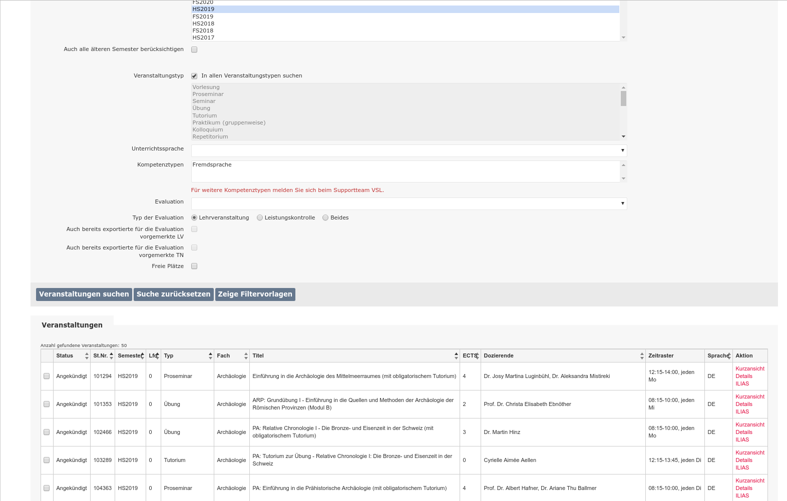
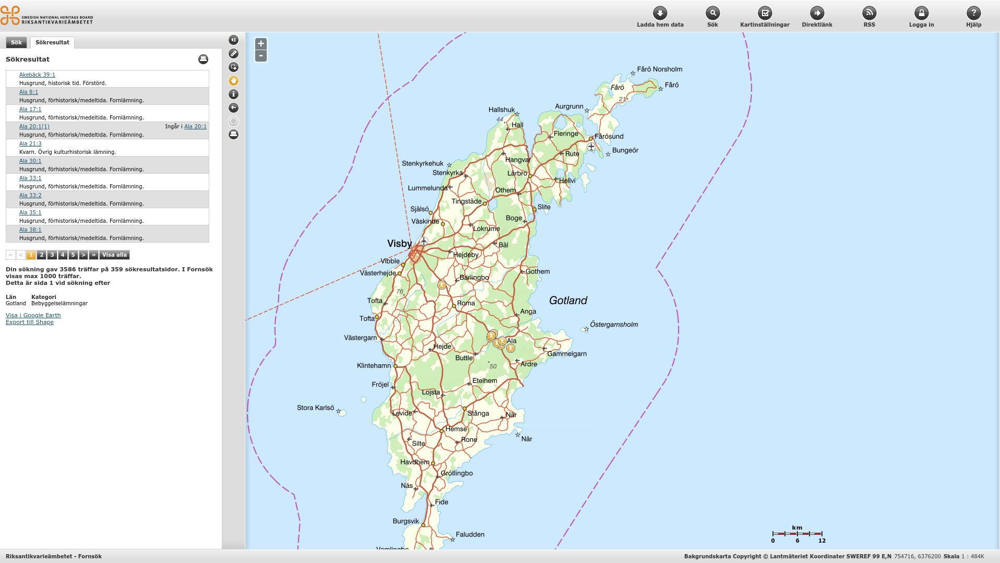

class: title-slide, center, middle
```{r, echo = FALSE}
# https://stackoverflow.com/questions/25646333/code-chunk-font-size-in-rmarkdown-with-knitr-and-latex
def.chunk.hook  <- knitr::knit_hooks$get("chunk")
knitr::knit_hooks$set(chunk = function(x, options) {
  x <- def.chunk.hook(x, options)
  ifelse(options$size != "normalsize", paste0("\\", options$size,"\n\n", x, "\n\n \\normalsize"), x)
})
```

```{r, echo = FALSE, results="asis"}
cat('# ', rmarkdown::metadata$title)
```

```{r, echo = FALSE, results="asis"}
cat('## ', rmarkdown::metadata$subtitle)
```

```{r, echo = FALSE, results="asis"}
cat('### ', rmarkdown::metadata$author)
```

```{r, echo = FALSE, results="asis"}
cat('#### ', rmarkdown::metadata$institute)
```

```{r, echo = FALSE, results="asis"}
cat(rmarkdown::metadata$date)
```

---
## Database then
.pull-left[

.caption[source: https://www.ssa.gov]
]

.pull-right[

.caption[Source: https://www.ssa.gov]
]
---
## Database now

.pull-left[

.caption[source: https://lifewire.com]


.caption[source: https://amazon.de]
]

.pull-right[

.caption[source: https://www.ksl.unibe.ch]


.caption[source: http://www.fmis.raa.se]
]

---
## Database now


.caption[source: Hellerstein/Olston 2005, Introduction to Database Systems]

---
## What is a Database?

- A (typically very large) integrated collection of data.
- Typically models a real-world situation:
  - Entities (e.g., teams, games)
  - Relationships (e.g. YB is playing in the Champions League)
- Computerised database systems are now very commonplace
- Information is stored in a database every time we: 
  - use a bank account
  - book a travel ticket
  - make an appointment with a doctor
  - etc.
- To actually store the data, and to do anything useful with it, you need a Database Management System (DBMS)

---
## DBMS

.pull-left[
- Microsoft Access
  - aimed at small businesses, and useful for desktop applications and systems with a small number of users
- Microsoft SQL Server, Oracle, IDM DB2
  - scalable and professional, and widely used by large organisations
- MySQL, PostgreSQL
  - open-source and quite powerful, widely used in web sites
- JavaDB, SQLite
  - compact DBMSs, suitable for mobile devices in particular
- ...and many more
]

.pull-right[

.caption[source: Paterson, Introduction to Database Development]
]
---
## Data models

- The way in which data is organised for storage in a database is known as the data model 
- Early computer databases developed in the 1960’s used a hierarchical model, similar to the way files and folders are still organised in computer file systems
- Most data does not fit very well into a simple hierarchy

.pull-left[
Hierarchical data

.caption[source: Paterson, Introduction to Database Development]
]

.pull-right[
“Real-world” data – no clear hierarchy

.caption[source: Paterson, Introduction to Database Development]
]

- Relatively complex data like this is better handled with the relational model
- Most databases nowadays are relational databases
  - although there are others: object databases, XML databases, “NoSQL” databases

---

## Designing a data model
### Entity - Relationship (ER)

.pull-left[
**Entity:**<sup>\*</sup>   Real-world object, distinguishable from other objects. An entity is described using a set of attributes. 

**Relationship:**<sup>\*</sup>  Association among two or more entities.  E.g., a fibula was found at Münsingen.
- relationships can have their own attributes.
]

.pull-right[
```{r echo=FALSE, message=F}
library(DiagrammeR)
my_dia <- DiagrammeR::grViz("
digraph models_diagram {
    rankdir='LR';
    graph[overlap=false, splines=true]
    'site' [shape=record, label='{\\
      site|name :string\\l\\
      lat :float\\l\\
      lng :float\\l\\
    }']
    
    'artefact' [shape=record, label='{artefact|\\
      material :string\\l\\
      weight :string\\l\\
    }']
    
    'found_at' [shape=diamond, label='
      found_at\\l\\
      date :datetime
    ']
    

    'site' -> 'found_at' [label='1']
    'found_at' -> 'artefact' [label='N']
}", height=100, width=400)

my_dia
```


.footnote[.tiny[<sup>\*</sup>**Entity Set:**  A collection of similar entities.  E.g., all employees.
- All entities in an entity set have the same set of attributes. (Basically)
- Each entity set has a key (!).
- Each attribute has a domain, that means, a range of possible values.

<sup>\*</sup>**Relationship Set:**  Collection of similar relationships.
]]
]


---
## Types of Relationships

### 1:1, 1:m, n:m

.pull-left[
#### Examples

- potsherds and features (n:m)
  - the sherds of one pot can be found at 1:n features
  - a feature can contain 1:n potsherds
  
- sample and measurements (1:m)
  - 1 sample has 1:n measurements
  
- artefact and find lable (1:1)
  - 1 Artefact has 1 find label
]

.pull-right[

]
---
## (primary) keys

Each record must be uniquely identifiable.

Primary key!

either
  - a set of attributes that are already there and make the record unique
    - example: Lab Code and Lab Number identify a radiocarbon date

or
 - is an explicit (artificial) attribute that is a sequential number
    - example: an id number from 1...&infin;

**The latter is not pure dogma, but most of the time more pratical**

---
## (primary & foreign) keys

If a record is uniquely identifiable, this can be used in relation to other entities:

.pull-left[
.pull-left[
|sites|
|-----------|
| Münsingen |
| Worb      |

]
.pull-right[
|burials|
|----------|
| Burial 1 |
| Burial 2 |
| Burial 3 |
| Burial 1 |
| Burial 2 |
| Burial 3 |
]
]

.pull-right[
.pull-left[
| id | site      |
|----|-----------|
| 1  | Münsingen |
| 2  | Worb      |
]
.pull-right[
| id | burial   | site_id |
|----|----------|---------|
| 1  | Burial 1 | 1       |
| 2  | Burial 2 | 1       |
| 3  | Burial 3 | 1       |
| 4  | Burial 1 | 2       |
| 5  | Burial 2 | 2       |
| 6  | Burial 3 | 2       |
]
]

The identifier of a record is the **primary key**.

The identifier of another record in relation to this one is the **foreign key**.

---
## Normalisation

> **Database normalization** is the process of structuring a relational database in accordance with a series of so-called normal forms in order **to reduce data redundancy** and **improve data integrity**. -- wikipedia

.tiny[
| site_id | site_name | lat  | lng | Kanton | Country     | burial_name | artefact_name                  | literature               |
|---------|-----------|------|-----|--------|-------------|-------------|--------------------------------|--------------------------|
| 1       | Münsingen | 46.8 | 7.6 | Bern   | Switzerland | Grab 1      | Halsring                       | Hodson 1960, Schaff 1976 |
| 1       | Münsingen | 46.8 | 7.6 | Bern   | Switzerland | Grab 1      | Fibel LTA                      | Hodson 1960, Schaff 1976 |
| 1       | Münsingen | 46.8 | 7.6 | Bern   | Switzerland | Grab 1      | Fibel LTA                      | Hodson 1960, Schaff 1976 |
| 1       | Münsingen | 46.8 | 7.6 | Bern   | Switzerland | Grab 1      | Bernsteinkette                 | Hodson 1960, Schaff 1976 |
| 1       | Münsingen | 46.8 | 7.6 | Bern   | Switzerland | Grab 2      | Fibel LTA                      | Hodson 1960, Schaff 1976 |
| 1       | Münsingen | 46.8 | 7.6 | Bern   | Switzerland | Grab 2      | Arm-/Fussring gerippt vollguss | Hodson 1960, Schaff 1976 |
| 1       | Münsingen | 46.8 | 7.6 | Bern   | Switzerland | Grab 2      | Schwert                        | Hodson 1960, Schaff 1976 |
| 1       | Münsingen | 46.8 | 7.6 | Bern   | Switzerland | Grab 3      | Fibel LTB                      | Hodson 1960, Schaff 1976 |
| 1       | Münsingen | 46.8 | 7.6 | Bern   | Switzerland | Grab 3      | Schwert                        | Hodson 1960, Schaff 1976 |
| 2       | Worb      | 46.9 | 7.5 | Bern   | Switzerland | Grab 1      | Arm-/Fussring gerippt vollguss | Schaff 1976              |
| 2       | Worb      | 46.9 | 7.5 | Bern   | Switzerland | Grab 1      | Fibel LTB                      | Schaff 1976              |
| 2       | Worb      | 46.9 | 7.5 | Bern   | Switzerland | Grab 2      | Bernsteinkette                 | Schaff 1976              |
| 2       | Worb      | 46.9 | 7.5 | Bern   | Switzerland | Grab 2      | Fibel LTB                      | Schaff 1976              |
| 2       | Worb      | 46.9 | 7.5 | Bern   | Switzerland | Grab 3      | Halsring                       | Schaff 1976              |
| 2       | Worb      | 46.9 | 7.5 | Bern   | Switzerland | Grab 3      | Fibel LTA                      | Schaff 1976              |
]

.right[**Not Normal!!!**]
---
## First Normal Form (1NF), problem

To satisfy 1NF, the values in each column of a table must be **atomic**. (Meaning one information at the time)

Problem here: literature:

.tiny[
| site_id | site_name | lat  | lng | Kanton | Country     | burial_name | artefact_name                  | literature               |
|---------|-----------|------|-----|--------|-------------|-------------|--------------------------------|--------------------------|
| 1       | Münsingen | 46.8 | 7.6 | Bern   | Switzerland | Grab 1      | Halsring                       | Hodson 1960, Schaff 1976 |
| 1       | Münsingen | 46.8 | 7.6 | Bern   | Switzerland | Grab 1      | Fibel LTA                      | Hodson 1960, Schaff 1976 |

]

possible solution:

.tiny[
| site_id | site_name | lat  | lng | Kanton | Country     | burial_name | artefact_name                  | literature1  | literature2  |
|---------|-----------|------|-----|--------|-------------|-------------|--------------------------------|--------------|--------------|
| 1       | Münsingen | 46.8 | 7.6 | Bern   | Switzerland | Grab 1      | Halsring                       | Hodson 1960  | Schaff 1976  |
| 1       | Münsingen | 46.8 | 7.6 | Bern   | Switzerland | Grab 1      | Fibel LTA                      | Hodson 1960  | Schaff 1976  |
]

But do you all the time know, how many citations to expect?
---
## First Normal Form (1NF), better solution

separation into multiple tables, using primary and foreign keys, and a n:m relationship.

.pull-left[
.tiny[
| id | site_id | site_name | lat  | lng | Kanton | Country     | burial_name | artefact_name                  |
|----|---------|-----------|------|-----|--------|-------------|-------------|--------------------------------|
| 1  | 1       | Münsingen | 46.8 | 7.6 | Bern   | Switzerland | Grab 1      | Halsring                       |
| 2  | 1       | Münsingen | 46.8 | 7.6 | Bern   | Switzerland | Grab 1      | Fibel LTA                      |
| 3  | 1       | Münsingen | 46.8 | 7.6 | Bern   | Switzerland | Grab 1      | Fibel LTA                      |
| 4  | 1       | Münsingen | 46.8 | 7.6 | Bern   | Switzerland | Grab 1      | Bernsteinkette                 |
| 5  | 1       | Münsingen | 46.8 | 7.6 | Bern   | Switzerland | Grab 2      | Fibel LTA                      |
| 6  | 1       | Münsingen | 46.8 | 7.6 | Bern   | Switzerland | Grab 2      | Arm-/Fussring gerippt vollguss |
| 7  | 1       | Münsingen | 46.8 | 7.6 | Bern   | Switzerland | Grab 2      | Schwert                        |
| 8  | 1       | Münsingen | 46.8 | 7.6 | Bern   | Switzerland | Grab 3      | Fibel LTB                      |
| 9  | 1       | Münsingen | 46.8 | 7.6 | Bern   | Switzerland | Grab 3      | Schwert                        |
| 10 | 2       | Worb      | 46.9 | 7.5 | Bern   | Switzerland | Grab 1      | Arm-/Fussring gerippt vollguss |
| 11 | 2       | Worb      | 46.9 | 7.5 | Bern   | Switzerland | Grab 1      | Fibel LTB                      |
| 12 | 2       | Worb      | 46.9 | 7.5 | Bern   | Switzerland | Grab 2      | Bernsteinkette                 |
| 13 | 2       | Worb      | 46.9 | 7.5 | Bern   | Switzerland | Grab 2      | Fibel LTB                      |
| 14 | 2       | Worb      | 46.9 | 7.5 | Bern   | Switzerland | Grab 3      | Halsring                       |
| 15 | 2       | Worb      | 46.9 | 7.5 | Bern   | Switzerland | Grab 3      | Fibel LTA                      |
]]

.pull-right[
.pull-left[
.tiny[
| id | literature  |
|----|-------------|
| 1  | Hodson 1960 |
| 2  | Schaff 1976 |
]]

.pull-right[
.tiny[
| artefact_id | literature_id |
|-------------|---------------|
| 1           | 1             |
| 1           | 2             |
| 2           | 1             |
| 2           | 2             |
| 3           | 1             |
| 3           | 2             |
| 4           | 1             |
| 4           | 2             |
| 5           | 1             |
| 5           | 2             |
| 6           | 1             |
| 6           | 2             |
| 7           | 1             |
| 7           | 2             |
| 8           | 1             |
| 8           | 2             |
| 9           | 1             |
| 9           | 2             |
]
]]
---
## First Normal Form (1NF), reason

Queries of the database are eased by the 1NF or only possible when the attribute value ranges are atomic. For example, in a field containing an entire name string consisting of title, first name and surname, it is difficult to impossible to sort by surname.

---
## 2NF, problem

Each data record represents only one fact. If there is data in a table that does not represent only 1 fact, this data is subdivided into individual thematic tables.

or more formal:

It does not have any non-prime attribute that is functionally dependent on any proper subset of any candidate key of the relation. A non-prime attribute of a relation is an attribute that is not a part of any candidate key of the relation.

Problem here:

.tiny[
| id | site_id | site_name | lat  | lng | Kanton | Country     | burial_name | artefact_name                  |
|----|---------|-----------|------|-----|--------|-------------|-------------|--------------------------------|
| 1  | 1       | Münsingen | 46.8 | 7.6 | Bern   | Switzerland | Grab 1      | Halsring                       |
| 2  | 1       | Münsingen | 46.8 | 7.6 | Bern   | Switzerland | Grab 1      | Fibel LTA                      |
| 3  | 1       | Münsingen | 46.8 | 7.6 | Bern   | Switzerland | Grab 1      | Fibel LTA                      |
]

Mixed informations about sites, burials and artefacts

---
## 2NF, solution

separation into multiple tables, using primary and foreign keys, and a 1:m relationship.

.pull-left[
.tiny[
| id | site_id | burial_name | artefact_name                  |
|----|---------|-------------|--------------------------------|
| 1  | 1       | Grab 1      | Halsring                       |
| 2  | 1       | Grab 1      | Fibel LTA                      |
| 3  | 1       | Grab 1      | Fibel LTA                      |
| 4  | 1       | Grab 1      | Bernsteinkette                 |
| 5  | 1       | Grab 2      | Fibel LTA                      |
| 6  | 1       | Grab 2      | Arm-/Fussring gerippt vollguss |
| 7  | 1       | Grab 2      | Schwert                        |
| 8  | 1       | Grab 3      | Fibel LTB                      |
| 9  | 1       | Grab 3      | Schwert                        |
| 10 | 2       | Grab 1      | Arm-/Fussring gerippt vollguss |
| 11 | 2       | Grab 1      | Fibel LTB                      |
| 12 | 2       | Grab 2      | Bernsteinkette                 |
| 13 | 2       | Grab 2      | Fibel LTB                      |
| 14 | 2       | Grab 3      | Halsring                       |
| 15 | 2       | Grab 3      | Fibel LTA                      |
]]

.pull-right[
.tiny[
| id | site_name | lat  | lng | Kanton | Country     |  
|----|-----------|------|-----|--------|-------------|
| 1  | Münsingen | 46.8 | 7.6 | Bern   | Switzerland |
| 2  | Worb      | 46.9 | 7.5 | Bern   | Switzerland |
]]
---
## 2NF, reason

Consider this:

| id | site_name | lat  | lng | burial_name | artefact_name |
|----|-----------|------|-----|-------------|---------------|
| 1  | Münsingen | 46.8 | 7.6 | Grab 1      | Halsring      |
| 2  | Münsingen | 50   | 14  | Grab 1      | Fibel LTA     |
| 3  | Münsingen | 35   | 3   | Grab 1      | Fibel LTA     |

**Where, exactly is Münsingen now??? Data Inconsistency!!!**

The 2NF forces essentially "monothematic" relations in the scheme: each relation models only one fact.

This reduces redundancy and the associated risk of inconsistencies. Only logically/objectively related information can be found in a relation. This makes it easier to understand the data structures.
---
## 3NF, problem

No data in a record should automatically follow from other data in the same record.

.tiny[
| id | site_name | lat  | lng | Kanton | Country     |  
|----|-----------|------|-----|--------|-------------|
| 1  | Münsingen | 46.8 | 7.6 | Bern   | Switzerland |
| 2  | Worb      | 46.9 | 7.5 | Bern   | Switzerland |
]

From that Münsingen is in Kanton Bern, it automatically follows that it is in Switzerland!

Same reason as before, consider this:

.tiny[
| id | site_name | lat  | lng | Kanton | Country     |  
|----|-----------|------|-----|--------|-------------|
| 1  | Münsingen | 46.8 | 7.6 | Bern   | Switzerland |
| 2  | Worb      | 46.9 | 7.5 | Bern   | Uganda      |
]

**??? Data Inconsistency!!!**
---
## 3NF, problem

separation into multiple tables, using primary and foreign keys, and a 1:m relationship.

.pull-left[
.tiny[
| id | site_name | lat  | lng | kanton_id |
|----|-----------|------|-----|-----------|
| 1  | Münsingen | 46.8 | 7.6 | 1         |
| 2  | Worb      | 46.9 | 7.5 | 1         |
]
]

.pull-right[
.tiny[
| id | kanton_name | Country     |  
|----|-------------|-------------|
| 1  | Bern        | Switzerland |
]
]

### 3NF, benefits

- Transitive dependencies are immediately apparent, without the need to know the relationships between the data. They are represented by the structure of the relations.
- In addition, any remaining thematic intermixtures in the relation are eliminated: according to the 3NF, the relations of the schema are reliably monothematic.

---
## That's enought

There also exists the 4th, 5th and 6th Normal Form (not to mention the Boyce–Codd normal form (BCNF))...

In practise, normalising to the 3th Normal Form is absolutely enough.

> Informally, a relational database relation is often described as "normalized" if it meets third normal form. Most 3NF relations are free of insertion, update, and deletion anomalies. -- wikipedia

Most of that comes naturally if you think about your relations as objects in the 'Real World'<sup>tm</sup>.
---
## Let's get practical

.pull-left[
We want to design a data base for finds of your site.

What **Informations** do we like to record?

What **Entities** and **Relations** do we have?

What **Attributes** will the **Entities** have?

How can we transform that into tables (this usually comes naturally than)?
]

.pull-right[
.tiny[
```{r generate_sites_list, , echo=FALSE}
library(kableExtra)

sites <- read.csv("../sites_list.csv")

sites$link[is.na(sites$link)] <- ""
sites$link <- paste0("[link](", sites$link, ")")

kable(sites, format = "pipe", caption = " ", escape = FALSE)
```
]
]
---
class: inverse, middle, center
# Any questions?

.footnote[
.right[
.tiny[
You might find the course material (including the presentations) at

https://berncodalab.github.io/caa

You can contact me at

<a href="mailto:martin.hinz@iaw.unibe.ch">martin.hinz@iaw.unibe.ch</a>
]
]
]
