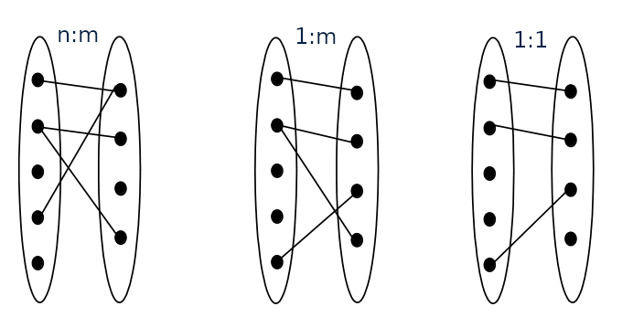
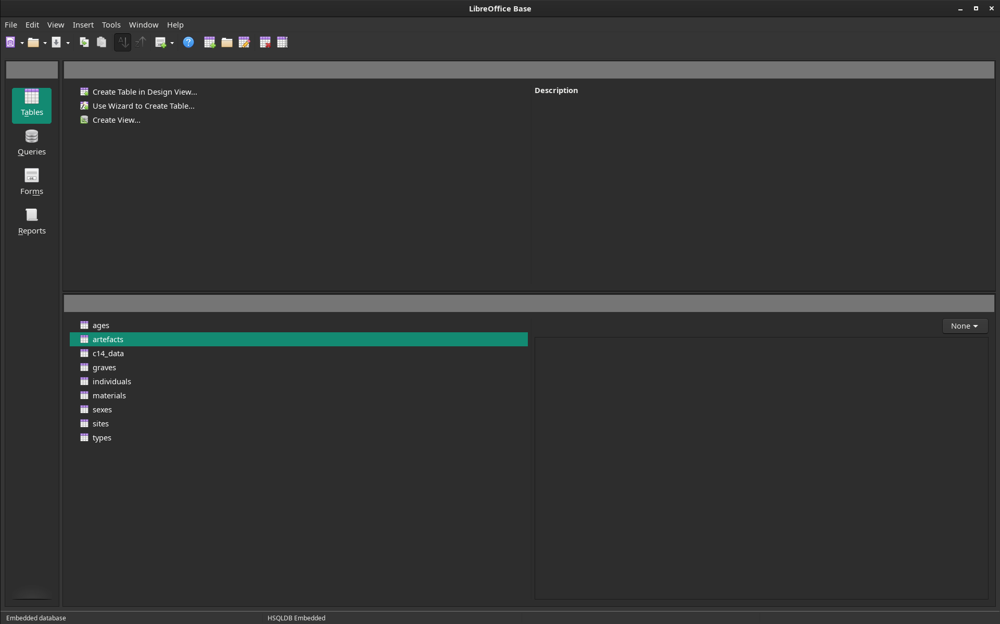
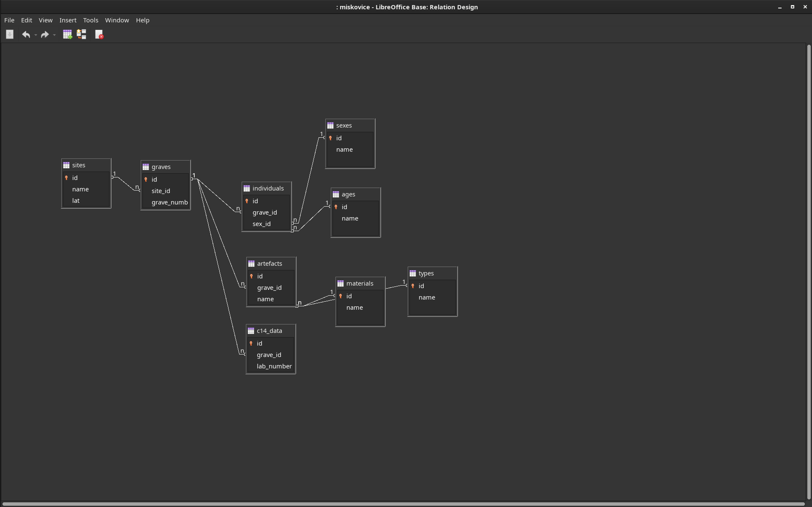
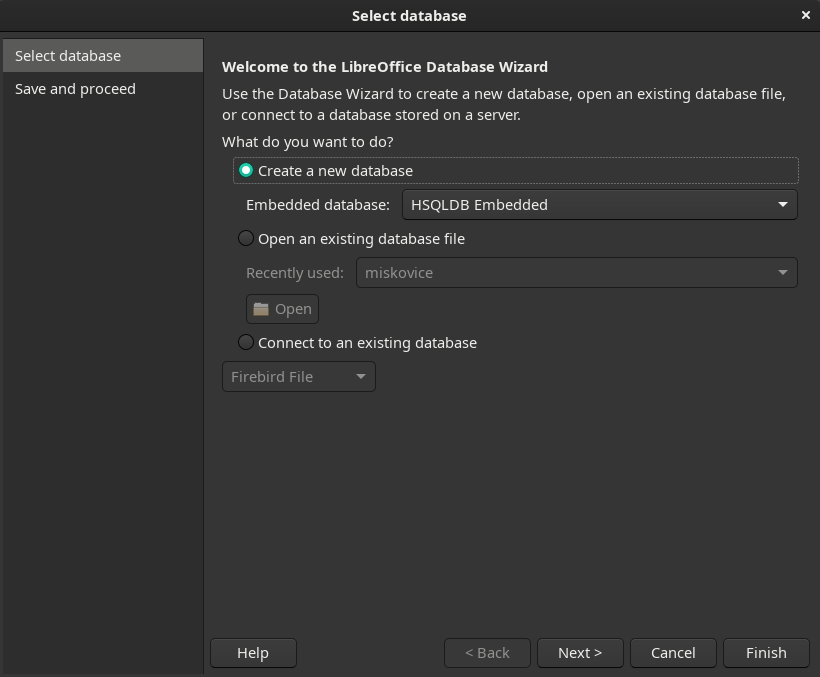
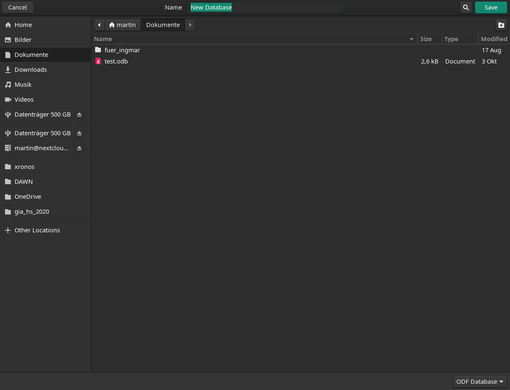
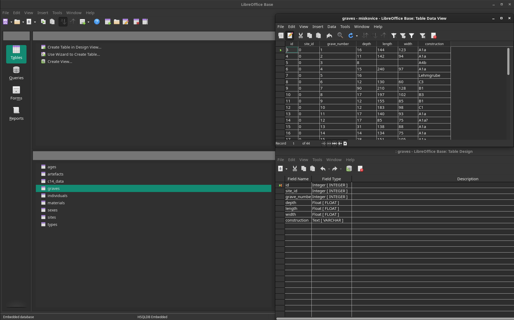
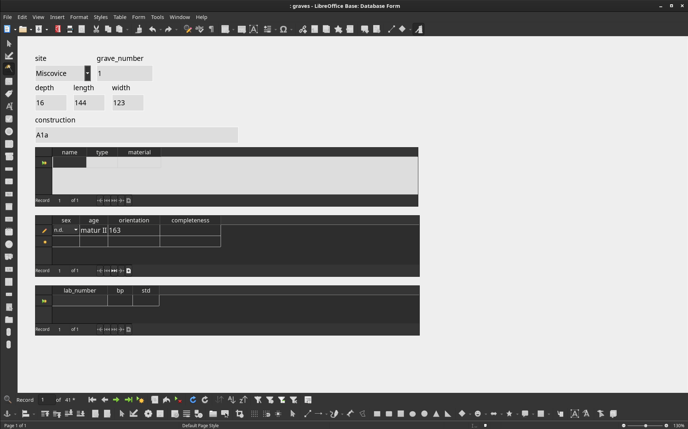
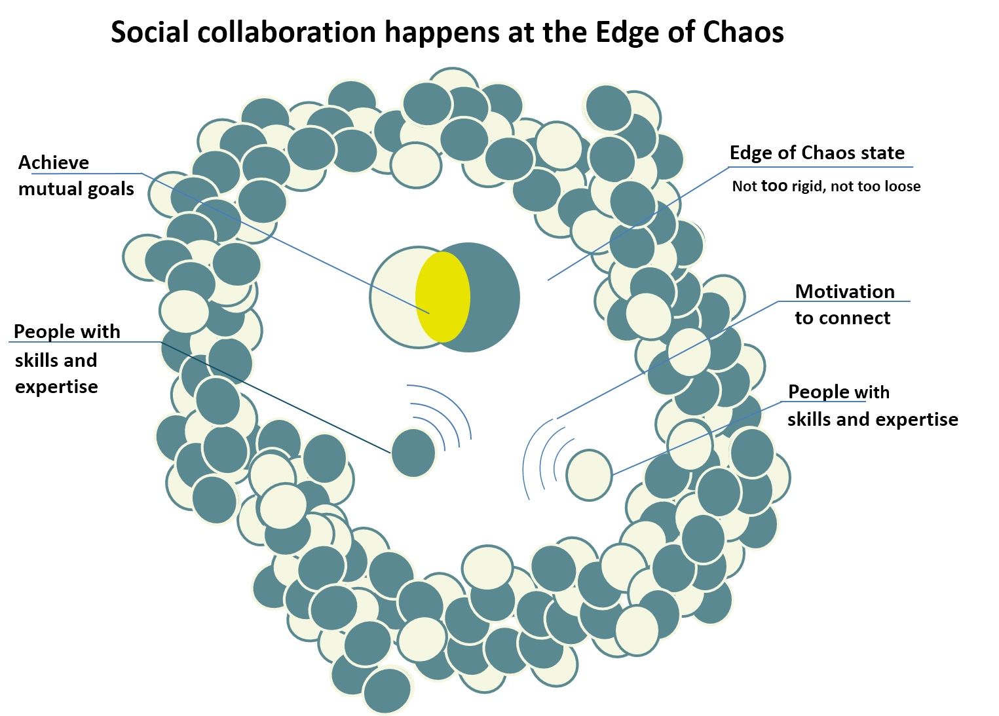
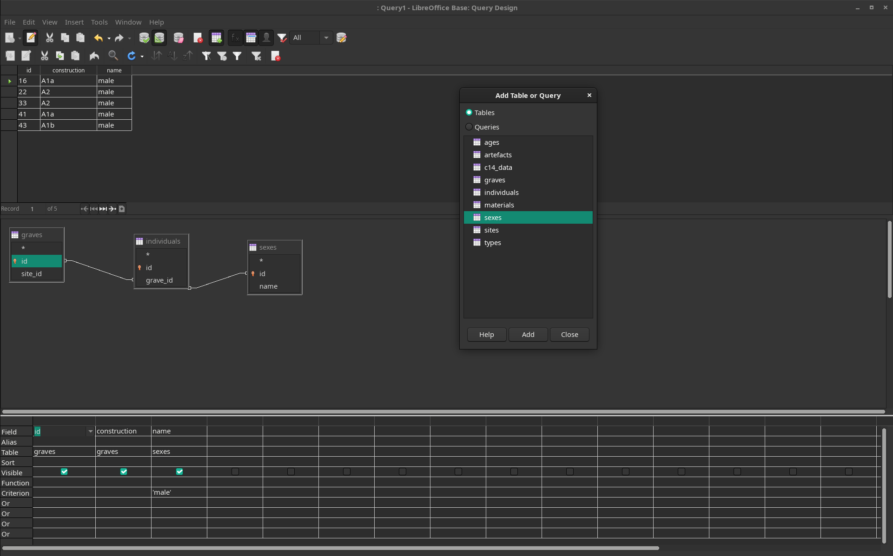

class: title-slide, center, middle
```{r, echo = FALSE}
# https://stackoverflow.com/questions/25646333/code-chunk-font-size-in-rmarkdown-with-knitr-and-latex
def.chunk.hook  <- knitr::knit_hooks$get("chunk")
knitr::knit_hooks$set(chunk = function(x, options) {
  x <- def.chunk.hook(x, options)
  ifelse(options$size != "normalsize", paste0("\\", options$size,"\n\n", x, "\n\n \\normalsize"), x)
})
```

```{r, echo = FALSE, results="asis"}
cat('# ', rmarkdown::metadata$title)
```

```{r, echo = FALSE, results="asis"}
cat('## ', rmarkdown::metadata$subtitle)
```

```{r, echo = FALSE, results="asis"}
cat('### ', rmarkdown::metadata$author)
```

```{r, echo = FALSE, results="asis"}
cat('#### ', rmarkdown::metadata$institute)
```

```{r, echo = FALSE, results="asis"}
cat(rmarkdown::metadata$date)
```

---
## Designing a data model
### Entity - Relationship (ER)

.pull-left[
**Entity:**<sup>\*</sup>   Real-world object, distinguishable from other objects. An entity is described using a set of attributes. 

**Relationship:**<sup>\*</sup>  Association among two or more entities.  E.g., a fibula was found at Münsingen.
- relationships can have their own attributes.
]

.pull-right[
```{r echo=FALSE, message=F}
library(DiagrammeR)
my_dia <- DiagrammeR::grViz("
digraph models_diagram {
    rankdir='LR';
    graph[overlap=false, splines=true]
    'site' [shape=record, label='{\\
      site|name :string\\l\\
      lat :float\\l\\
      lng :float\\l\\
    }']
    
    'artefact' [shape=record, label='{artefact|\\
      material :string\\l\\
      weight :string\\l\\
    }']
    
    'found_at' [shape=diamond, label='
      found_at\\l\\
      date :datetime
    ']
    

    'site' -> 'found_at' [label='1']
    'found_at' -> 'artefact' [label='N']
}", height=100, width=400)

my_dia
```
]

.footnote[.tiny[<sup>\*</sup>**Entity Set:**  A collection of similar entities.  E.g., all employees.
- All entities in an entity set have the same set of attributes. (Basically)
- Each entity set has a key (!).
- Each attribute has a domain, that means, a range of possible values.

<sup>\*</sup>**Relationship Set:**  Collection of similar relationships.
]]

---
## Types of Relationships

### 1:1, 1:n, n:m

.pull-left[
#### Examples

- potsherds and features (n:m)
  - the sherds of one pot can be found at 1:n features
  - a feature can contain 1:n potsherds
  
- sample and measurements (1:n)
  - 1 sample has 1:n measurements
  
- artefact and find lable (1:1)
  - 1 Artefact has 1 find label
]

.pull-right[

]
---
## (primary) keys

Each record must be uniquely identifiable.

Primary key!

either
  - a set of attributes that are already there and make the record unique
    - example: Lab Code and Lab Number identify a radiocarbon date

or
 - is an explicit (artificial) attribute that is a sequential number
    - example: an id number from 1...&infin;

**The latter is not pure dogma, but most of the time more pratical**

---
## (primary & foreign) keys

If a record is uniquely identifiable, this can be used in relation to other entities:

.pull-left[
.pull-left[
|sites|
|-----------|
| Münsingen |
| Worb      |

]
.pull-right[
|burials|
|----------|
| Burial 1 |
| Burial 2 |
| Burial 3 |
| Burial 1 |
| Burial 2 |
| Burial 3 |
]
]

.pull-right[
.pull-left[
| id | site      |
|----|-----------|
| 1  | Münsingen |
| 2  | Worb      |
]
.pull-right[
| id | burial   | site_id |
|----|----------|---------|
| 1  | Burial 1 | 1       |
| 2  | Burial 2 | 1       |
| 3  | Burial 3 | 1       |
| 4  | Burial 1 | 2       |
| 5  | Burial 2 | 2       |
| 6  | Burial 3 | 2       |
]
]

The identifier of a record is the **primary key**.

The identifier of another record in relation to this one is the **foreign key**.

---
## Normalisation

> **Database normalization** is the process of structuring a relational database in accordance with a series of so-called normal forms in order **to reduce data redundancy** and **improve data integrity**. -- wikipedia

.small[

### 1NF
To satisfy 1NF, the values in each column of a table must be **atomic**. (Meaning one information at the time)

### 2NF
Each data record represents only one fact. If there is data in a table that does not represent only 1 fact, this data is subdivided into individual thematic tables.

or more formal:

It does not have any non-prime attribute that is functionally dependent on any proper subset of any candidate key of the relation. A non-prime attribute of a relation is an attribute that is not a part of any candidate key of the relation.

### 3NF
No data in a record should automatically follow from other data in the same record.
]

---
## That's enought

There also exists the 4th, 5th and 6th Normal Form (not to mention the Boyce–Codd normal form (BCNF))...

In practise, normalising to the 3th Normal Form is absolutely enough.

> Informally, a relational database relation is often described as "normalized" if it meets third normal form. Most 3NF relations are free of insertion, update, and deletion anomalies. -- wikipedia

Most of that comes naturally if you think about your relations as objects in the 'Real World'<sup>tm</sup>.
---
## Let's get practical

.pull-left[
We want to design a data base for finds of your site.

What **Informations** do we like to record?

What **Entities** and **Relations** do we have?

What **Attributes** will the **Entities** have?

How can we transform that into tables (this usually comes naturally than)?
]

.pull-right[
.tiny[
```{r generate_sites_list, , echo=FALSE}
library(kableExtra)

sites <- read.csv("../sites_list.csv")

sites$link[is.na(sites$link)] <- ""
sites$link <- paste0("[link](", sites$link, ")")

kable(sites, format = "pipe", caption = " ", escape = FALSE)
```
]
]
---
## Structure of your Database

### Draft

You can start as you like, paper, blackboard, mindmap, actual ER design tool...

.center[

]

---
## Structure MiscoviceDB

### ER-Diagramm

```{r echo=FALSE, message=F}
library(DiagrammeR)
my_dia <- DiagrammeR::grViz("
digraph models_diagram {
    rankdir='LR';
    graph[overlap=false, splines=true]
    'sites' [shape=record, label='{\\
      sites|name :string\\l\\
      lat :float\\l\\
      lng :float\\l\\
    }']
    
    'graves' [shape=record, label='{graves|\\
      grave_number :string\\l\\
      depth :float\\l\\
      length :float\\l\\
      width :float\\l\\
      construction :text\\l\\
    }']
    
    'individuals' [shape=record, label='{individuals|\\
      sex :string\\l\\
      age :string\\l\\
      orientation :float\\l\\
      completeness :float\\l\\
    }']
    
    'artefacts' [shape=record, label='{artefacts|\\
      name :string\\l\\
      type :string\\l\\
      material :string\\l\\
    }']
    
    'c14_dates' [shape=record, label='{c14_dates|\\
      lab_code :string\\l\\
      bp :integer\\l\\
      std :integer\\l\\
    }']

    'sites' -> 'graves' [label='1:n']
    'graves' -> 'artefacts' [label='1:n']
    'graves' -> 'individuals' [label='1:n']
    'graves' -> 'c14_dates' [label='1:n']
    
}", height=400, width=800)

my_dia
```
---
## Structure MiscoviceDB

### Primary and foreign keys

```{r echo=FALSE, message=F}
library(DiagrammeR)
my_dia <- DiagrammeR::grViz("
digraph models_diagram {
    rankdir='LR';
    graph[overlap=false, splines=true]
    'sites' [shape=record, label='{sites|\\
      id :integer\\l\\
      name :string\\l\\
      lat :float\\l\\
      lng :float\\l\\
    }']
    
    'graves' [shape=record, label='{graves|\\
      id :integer\\l\\
      site_id :integer\\l\\
      grave_number :string\\l\\
      depth :float\\l\\
      length :float\\l\\
      width :float\\l\\
      construction :text\\l\\
    }']
    
    'individuals' [shape=record, label='{individuals|\\
      id :integer\\l\\
      grave_id :integer\\l\\
      sex :string\\l\\
      age :string\\l\\
      orientation :float\\l\\
      completeness :float\\l\\
    }']
    
    'artefacts' [shape=record, label='{artefacts|\\
      id :integer\\l\\
      grave_id :integer\\l\\
      name :string\\l\\
      type :string\\l\\
      material :string\\l\\
    }']
    
    'c14_dates' [shape=record, label='{c14_dates|\\
      id :integer\\l\\
      grave_id :integer\\l\\
      lab_code :string\\l\\
      bp :integer\\l\\
      std :integer\\l\\
    }']

    'sites' -> 'graves' [label='1:n']
    'graves' -> 'artefacts' [label='1:n']
    'graves' -> 'individuals' [label='1:n']
    'graves' -> 'c14_dates' [label='1:n']
    
}", height=400, width=800)

my_dia
```
---
## Structure MiscoviceDB

### Lookup tables

```{r echo=FALSE, message=F}
library(DiagrammeR)
my_dia <- DiagrammeR::grViz("
digraph models_diagram {
    rankdir='LR';
    graph[overlap=false, splines=true]
    'sites' [shape=record, label='{sites|\\
      id :integer\\l\\
      name :string\\l\\
      lat :float\\l\\
      lng :float\\l\\
    }']
    
    'graves' [shape=record, label='{graves|\\
      id :integer\\l\\
      site_id :integer\\l\\
      grave_number :string\\l\\
      depth :float\\l\\
      length :float\\l\\
      width :float\\l\\
      construction :text\\l\\
    }']
    
    'individuals' [shape=record, label='{individuals|\\
      id :integer\\l\\
      grave_id :integer\\l\\
      sex_id :integer\\l\\
      age_id :integer\\l\\
      orientation :float\\l\\
      completeness :float\\l\\
    }']
    
    'sexes' [shape=record, label='{sexes|\\
      id :integer\\l\\
      name :string\\l\\
    }']
    
    'artefacts' [shape=record, label='{artefacts|\\
      id :integer\\l\\
      grave_id :integer\\l\\
      name :string\\l\\
      type_id :integer\\l\\
      material_id :integer\\l\\
    }']
    
    'types' [shape=record, label='{types|\\
      id :integer\\l\\
      name :string\\l\\
    }']
    
    'materials' [shape=record, label='{materials|\\
      id :integer\\l\\
      name :string\\l\\
    }']
    
    'ages' [shape=record, label='{ages|\\
      id :integer\\l\\
      name :string\\l\\
    }']
    
    'c14_dates' [shape=record, label='{c14_dates|\\
      id :integer\\l\\
      grave_id :integer\\l\\
      lab_code :string\\l\\
      bp :integer\\l\\
      std :integer\\l\\
    }']

    'sites' -> 'graves' [label='1:n']
    'graves' -> 'artefacts' [label='1:n']
    'graves' -> 'individuals' [label='1:n']
    'graves' -> 'c14_dates' [label='1:n']
    'types' -> 'artefacts' [label='1:n']
    'materials' -> 'artefacts' [label='1:n']
    'sexes' -> 'individuals' [label='1:n']
    'ages' -> 'individuals' [label='1:n']
    
}", height=400, width=800)

my_dia
```
---
## Structure reflected in the DB-Program

.pull-left[
* Tables -> Tables
* Relationships -> primary and foreign keys, relationship using the relationship tool

Things look different in eg. MS Access, but work the same
]

.pull-right[


]
---
## To start

.pull-left[
* Open LibreOffice Base
* Create a new Database
* Click on Finish
* Save your new Database to a reasonable folder
]

.pull-right[


]
---
## Tables

.pull-left[
Store your information on specific items (rows) with defined fields (columns)

* Double click shows the stored information
* Right Click > Edit lets you change the field definitions (dangerous, if you have already data!!!)
]

.pull-right[

]
---
## Relationsships
.pull-left[
Define the relationships between your tables

* most important is the reasonable naming of the primary key ('id'!?) and the foreign keys ('site_id'!?)
* Defining the relationships in the "Relationship tool" helps to ease things later on (it provides information for the database tool)
]

.pull-right[

]

---
## Forms
.pull-left[
Help to structure your inputs

* Give the user (you?) a nice entry form
* Enable to select values easily with dropdown fields and lookup tables
* limit and structure the possible entry values
* enable with subforms to enter data to different tables at once
]

.pull-right[

]
---
## Data Entry

.pull-left[
Your task within the next two weeks:

* Enter data from your sites into the database with the structure you designed
* Distribute the work, share your workload!!!
]

.pull-right[

.caption[source:https://commons.wikimedia.org/wiki/File:Social_collaboration_at_edge_of_chaos.jpg]
]
---
## Queries

.pull-left[
...are structured ways to receive information with specific conditions

* Most desktop DB systems offer "Wizards" and Tools to design a query
* In the background it will (nearly always) be SQL
* SQL [ˈsiːkwəl]: "Structured Query Language"
]

.pull-right[

]
```{sql, eval=F}
SELECT "graves"."id", "graves"."construction", "sexes"."name"
  FROM "individuals", "graves", "sexes"
 WHERE "individuals"."grave_id" = "graves"."id"
     AND "individuals"."sex_id" = "sexes"."id"
     AND "sexes"."name" = 'male';
```
---
class: inverse, middle, center
# Any questions?

.footnote[
.right[
.tiny[
You might find the course material (including the presentations) at

https://berncodalab.github.io/caa

You can contact me at

<a href="mailto:martin.hinz@iaw.unibe.ch">martin.hinz@iaw.unibe.ch</a>
]
]
]
