class: title-slide, center, middle
```{r, echo = FALSE, warning=F, message=FALSE}
# https://stackoverflow.com/questions/25646333/code-chunk-font-size-in-rmarkdown-with-knitr-and-latex
def.chunk.hook  <- knitr::knit_hooks$get("chunk")
knitr::knit_hooks$set(chunk = function(x, options) {
  x <- def.chunk.hook(x, options)
  ifelse(options$size != "normalsize", paste0("\\", options$size,"\n\n", x, "\n\n \\normalsize"), x)
})
library(ggplot2)
library(ggrepel)
```

```{r, echo = FALSE, results="asis"}
cat('# ', rmarkdown::metadata$title)
```

```{r, echo = FALSE, results="asis"}
cat('## ', rmarkdown::metadata$subtitle)
```

```{r, echo = FALSE, results="asis"}
cat('### ', rmarkdown::metadata$author)
```

```{r, echo = FALSE, results="asis"}
cat('#### ', rmarkdown::metadata$institute)
```

```{r, echo = FALSE, results="asis"}
cat(rmarkdown::metadata$date)
```
---

## Why data visualisation

Converting raw data to a form that is viewable and understandable to humans

.pull-left[
* humans are visual animals -> we evolved to identify patterns visually
* helps to map complex information into an meaningful picture
* enables to "see" more than two dimensions of the data and their interplay
]

.pull-right[
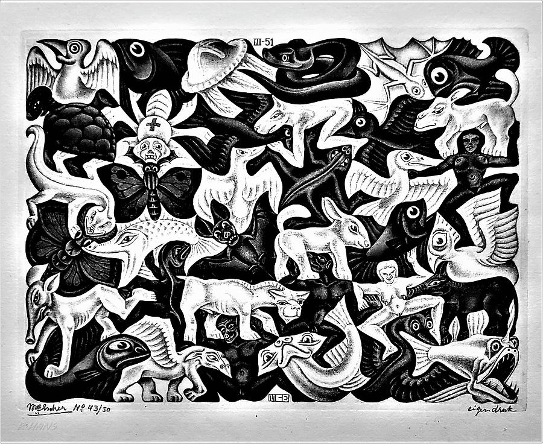
]

---

## Data, variables, values

.pull-left[
- variable:
  - What ist measured or analysed.
  - e.g. height
- item:
  - That whichs variable is measure
  - e.g. me as „possessor“ of a height, graves, persons...
- values:
  - The actual measurement.
  - e.g. my height is 1.81 m.
]

.pull-right[
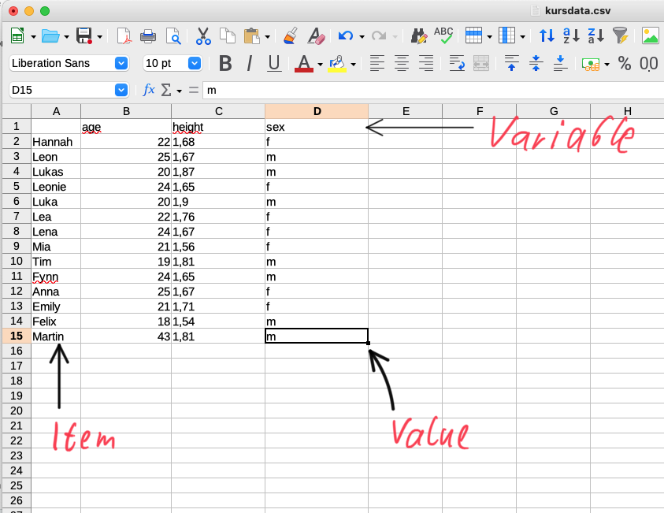
]

---

## Levels of measurement

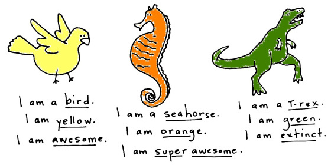

### nominal or categorical:
  - You can only decide if something belongs to a category
  - Categories which do not have a defined relationship among each other, only counting is possible (e.g. sex)
  
---

## Levels of measurement

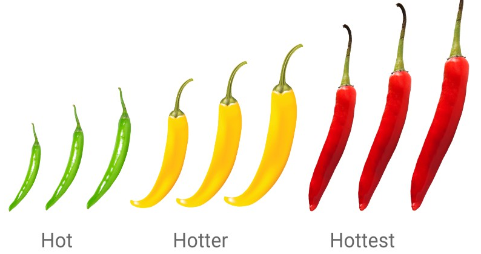

### ordinal:
  - Categories which are comparable and differ from each other in their characteristic [size/power/intensity]
  - their rank is determinable (e.g. preservation conditions – bad < medium < good)

---

## Levels of measurement

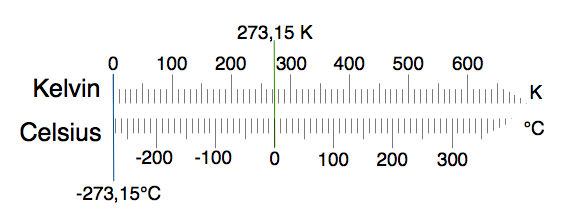

### metric:
  - Variable has a defined system of measurement, all calculations are possible. To distinguish are

1. interval: The variable has an arbitrary choosen neutral point (°C)
2. ratio: The variable has an absolute neutral point (°K)

- Sometimes also used: absolut scale
  - counts (number of inhabitans)

---

## Levels of measurement

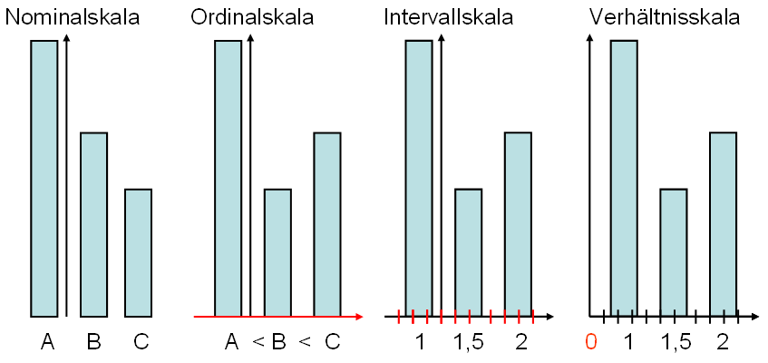
---

## continuous vs. discrete

.pull-left[
### discrete variable:
  - Variable which can take only certain values without intermediate values
  - e.g. income, counts of ceramic objects, sex (?)
  - 'counted'
  
### continuous variables:
  - Variable which can take all value and intermediate value
  - e.g. height, temperature, proportion value
  - 'measured'
]

.pull-right[
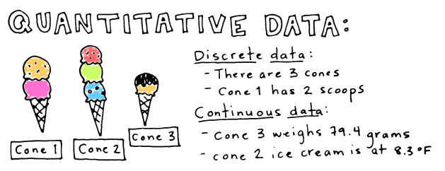

.caption[Source: https://statsthewayilikeit.com]
]

---
## Cross tables (contingency tables)

### For summary of data

Cross tabulations summarise (mostly) categorical data by counting the co-occurrence of 2 (or more) categories per unit.

.pull-left[
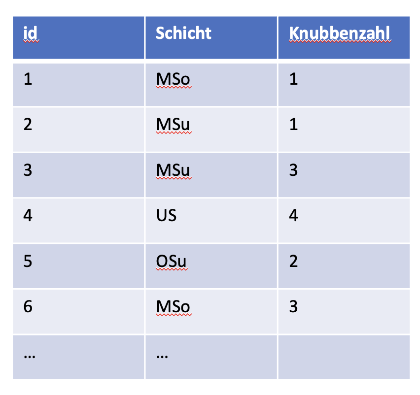
]
.pull-right[
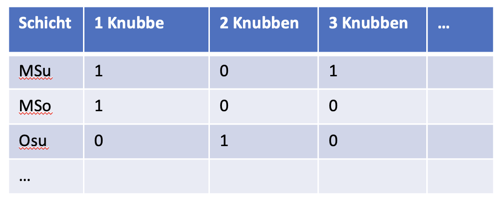
]

-> "Pivot-Table"
---
## Successful visualisation of the past

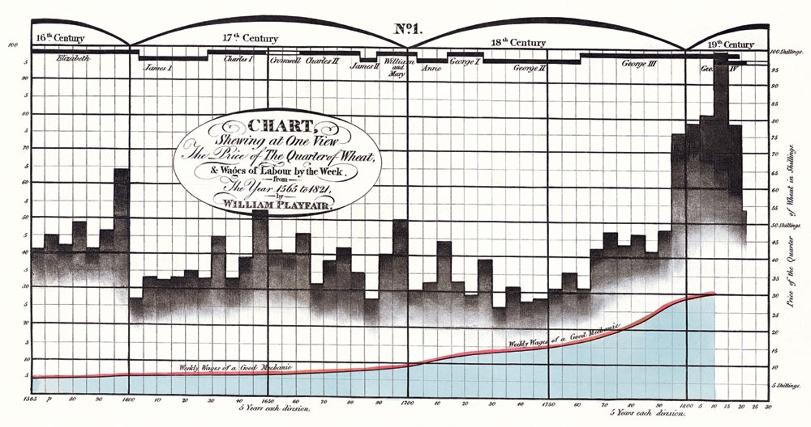

.caption[William Playfair, 1786. source: wikipedia]
---
## Successful visualisation of the past

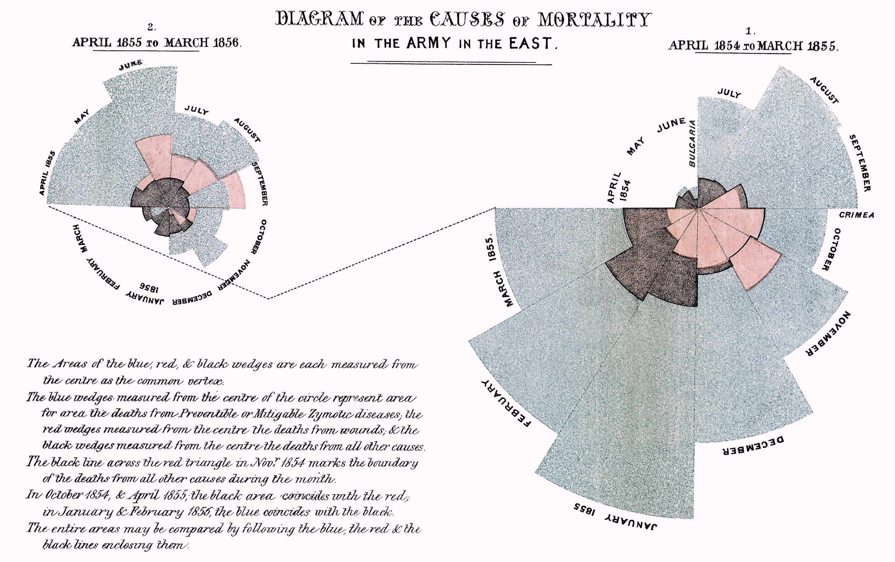

.caption[Florence Nightingale, 1857. source: wikipedia]

---
## Successful visualisation of the past

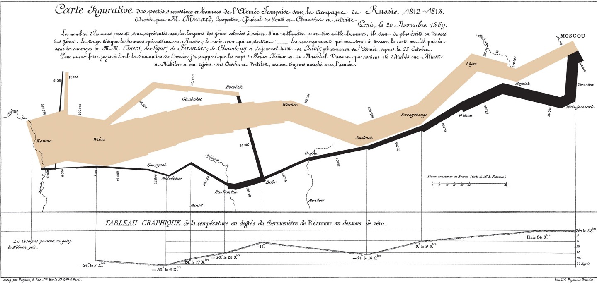
.caption[Charles Joseph Minard, 1869. source: wikipedia]

---
## Objects of Visualisation

.pull-left[
### Items

Objects you like to display (entities in DB speach)

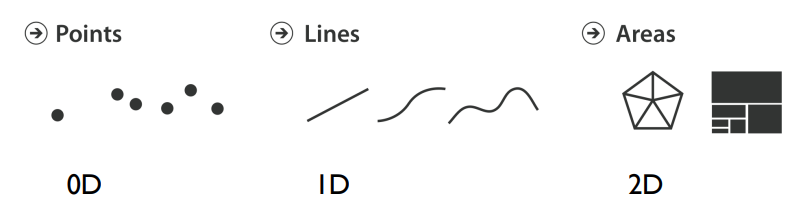
]
.pull-right[
### Links

The relationships of these objects, if there are any (Relationship also in DB speach)

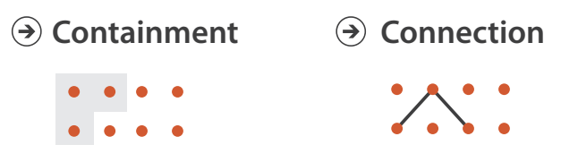
]
.caption[Machiraju 2020]

---
## Dimensions of Visualisation

.pull-left[
* Position (coordinates, slope, orientation, ...)
* Color (Hue, Saturation, Transparency)
* Texture
* Shape
* Size (length, area, [Volume])

* Proximity/Density

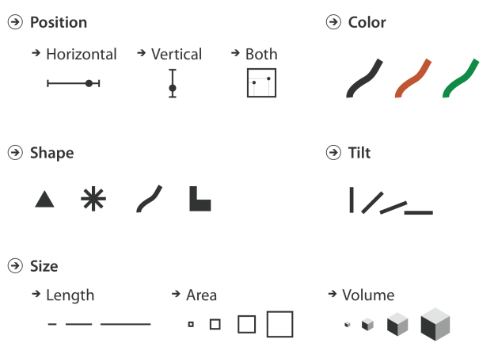
.caption[Machiraju 2020]
]

.pull-right[
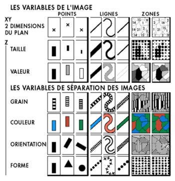
.caption[Bertin 1967]

]
---
## Combining Dimensions of Visualisation

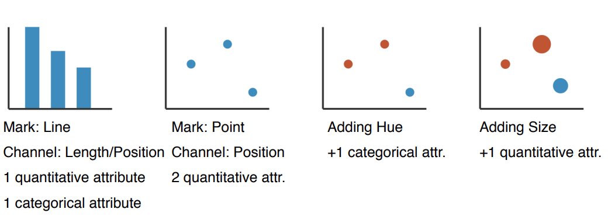
.caption[Machiraju 2020]

---
## Dimensions of Visualisation and levels of measurement

* Position (coordinates, slope, orientation, ...)
* Color (Hue, Saturation, Transparency)
* Texture
* Shape
* Size (length, area, [Volume])

* Proximity/Density


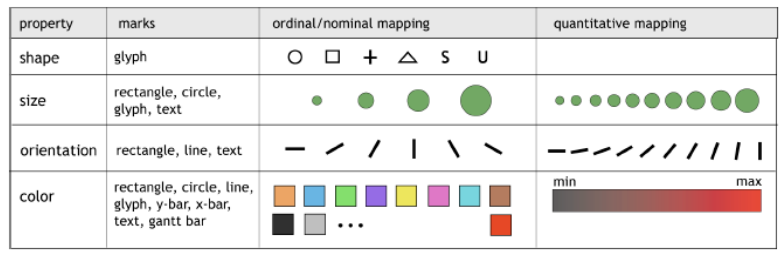
.caption[Machiraju 2020]

---

## Basics about charts

.pull-left[
### Principles for good charts according to E. Tufte:
(The Visual Display of Quantitative Information. Cheshire/
Connecticut: Graphics Press, 1983)

- „Graphical exellence is that which gives to the viewer the greatest number of ideas in the shortest time with the least ink in the smallest space.”
- Data-ink ratio = „proportion of a graphic’s ink devoted to the non-redundant display of data-information“ (kein chartjunk!)
- „Graphical excellence is often found in simplicity of design and complexity of data.“

\- after Müller-Scheeßel
]

.pull-right[
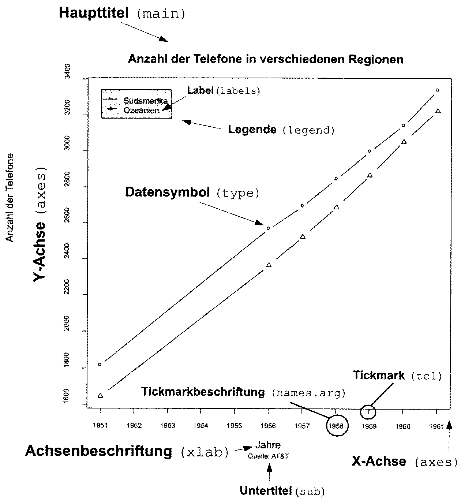
]

---
## Pie chart [1]

.pull-left[
The classical one – but comes with destinct flaws...

Used to display proportions, suitable for nominal data

$$
a_i = \frac{n_i} {N} * 360°
$$


Disadvantages:
- Color selection can influence the perception (red is seen larger then gray)
- Small differences are not easy visible

**totally No-Go: 3d-pies!!!**
]

.pull-right[

]

---

## Pie chart [2]

I eat pie...

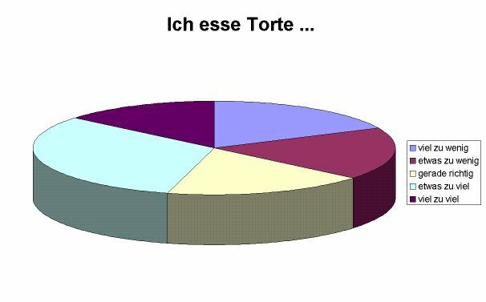

.caption[source: http://www.lrz-muenchen.de/~wlm]

*The pieces »viel zu wenig«, »etwas zu wenig« und »gerade richtig« have exactly the same size, the piece »viel zu viel« is a bit smaller.*

---
## Pie chart [3]
.pull-left[
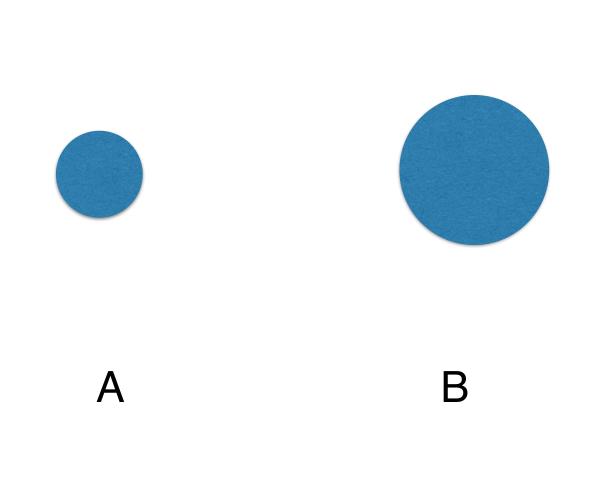
3x
]

.pull-right[
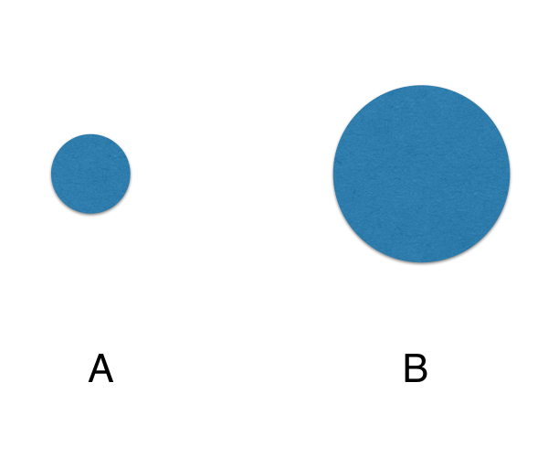
5x
]

---

## Bar plot [1]
.pull-left[
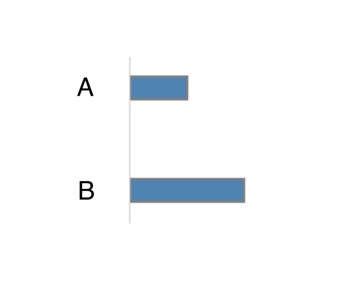
2x
]

.pull-right[
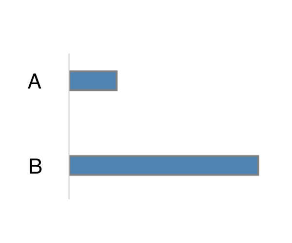
4x
]


---

## Bar plot [2]

Generally the better alternative...
Bar plots are suitable for display of proportions as well as for absolute data. They can be used for every level of measurement.

.pull-left[
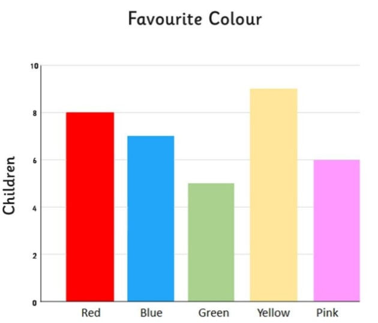
]

.pull-right[
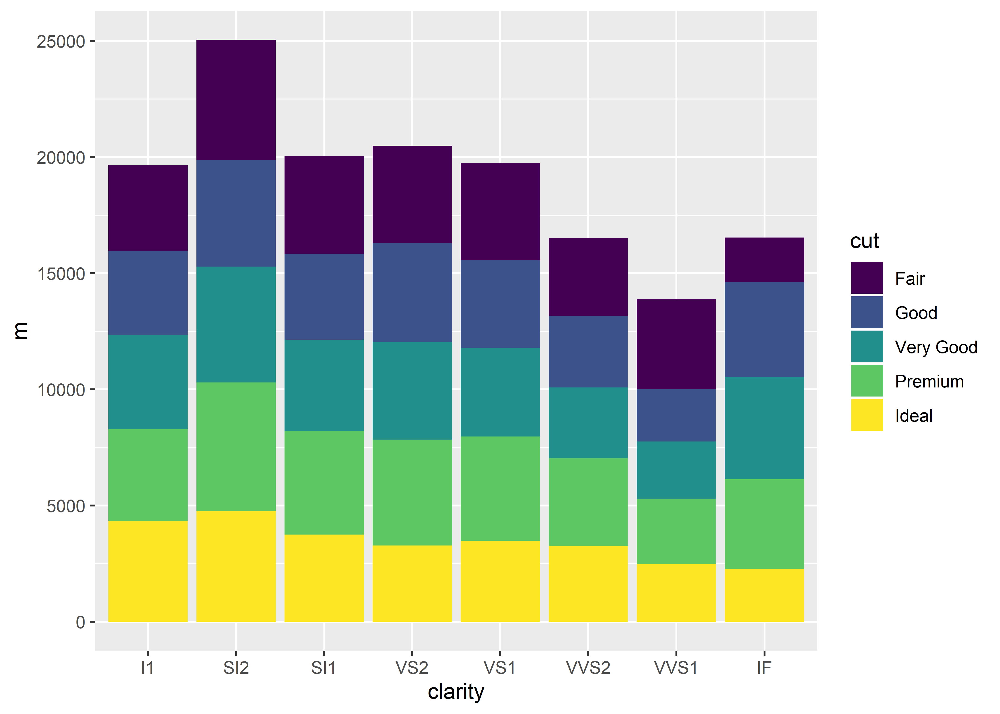

]

---

## Bar plot [3]

Combination of different information and proportional visualisation is possible.

.pull-left[
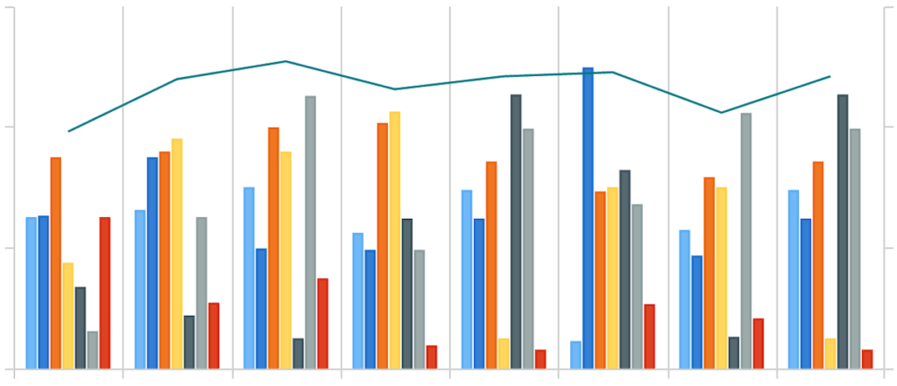
]

.pull-right[
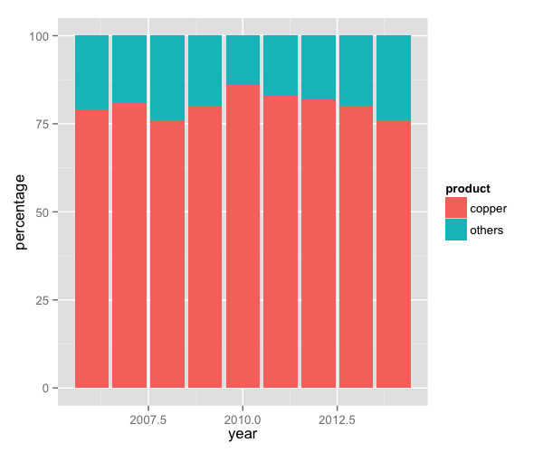

]

---
## Scatterplot

Shows the relationship between two (metric) variables

.pull-left[
You can see:

- values of items (points) on both variables
- relationship between variables
  - positive or negative relationship (or no at all)
- you can compute quantitative values describing the relationship
  - regression analysis
]


.pull-right[
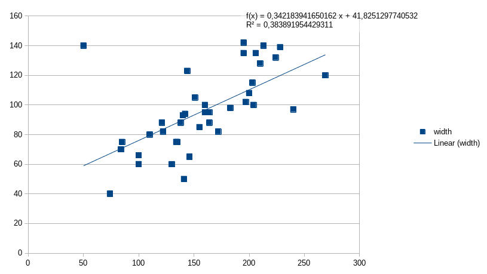
]
```{r, echo = FALSE}
muensingen <- read.csv2("data/muensingen_fib.csv", row.names = 1)
```
---
## Scatterplot

Shows the relationship between two (metric) variables

.pull-left[
### R

```{r, echo=FALSE, message=F, fig.height=5}
library(car) # library for regression analysis
scatterplot(FL ~ Length, data = muensingen)
```
]


.pull-right[
### Libre Office


]
---

## Box-plot (Box-and-Whiskers-Plot)

One of the best (my precious)!
.pull-left[
Used to display the distribution of values in a data vector of metrical (interval, ratio) scale
<pre>
1 2 3 4 5 6 7 8 9
____|___|___|____
</pre>

- thick line: median
- Box: the inner both quantiles
- Whisker: last value < than 1.5 times the distance of the inner quantile

]

.pull-right[
```{r echo=F, fig.dim=c(5,3)}
op <- par(mar = c(0, 4,0,0))
boxplot(1:9)
par(op)

```

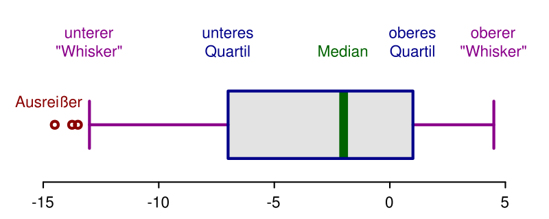
]

---

## Box Plot [2]

.pull-left[
```{r echo=F}
boxplot(muensingen$Length)
```
]

.pull-right[
```{r echo=F}
boxplot(muensingen$Length ~
          muensingen$fibula_scheme)
```
]

---

## Histogramm
Used for classified display of distributions
Data reduction vs. precision: Display of count values of classes of values

.pull-left[
```{r, fig.height=5, echo=FALSE}
hist(muensingen$Length, labels = T)
```

]

.pull-right[
```{r, fig.height=5, echo=FALSE}
hist(muensingen$Length,
     labels = T,
     breaks = 10)
```
]

Disadvantages:
- Data reduction vs. precision → loss of information
- Actual display depends strongly on the choosen class width

---

## kernel smoothing (kernel density estimation)

Another attempt to overcome the disadvantages of a histogram

The distribution of the values is considered and a distribution curve is
calculated. Continuous distributions are better displayed, without artificial
breaks. Scales like histograms.

.pull-left[
```{r, fig.height=5, echo=F}
plot(density(muensingen$Length))
```
]

.pull-right[
Histogram and kernel-density-plot together

```{r, fig.height=5, echo=F}
hist(muensingen$Length, prob=T)
lines(density(muensingen$Length))
```
]

---

## Style of charts

### Stay honest!

Choice of display has a strong influence on the statement.

```{r echo=F, fig.height=6}
par(mfrow=c(2,2))
dax <- read.csv("data/dax.csv", stringsAsFactors = F)
dax.ts <- ts(dax$Close, frequency = 12, start = c(1987,11))
plot(window(dax.ts, start=2008, end=2010),type = "l", ylab="Dax")
plot(window(dax.ts, start=2008, end=2010),type = "l", ylab="Dax", ylim=c(0,8000))
plot(window(dax.ts, start=2000, end=2010),type = "l", ylab="Dax", ylim=c(0,8000))
plot(window(dax.ts, end=2010),type = "l", ylab="Dax", ylim=c(0,8000))
par(mfrow=c(1,1))
```

---

## Style of charts

### Stay honest!
Choice of display has a strong influence on the statement.

### Clear layout!
Minimise Ratio of ink per shown information!

### Use the suitable chart for the data!
Consider nominal-ordinal-interval-ratio scale

---

## Suggestions for charts

| What to display | suitable | not suitable|
| - | - | - |
| Parts of a whole: few | Pie chart, stacked bar plot | |
| Parts of a whole: few | Stacked bar plot | |
| Multiple answers (ties) | Horizontal bar plot | Pie chart, stacked bar plot |
| Comparison of different values of different variables | Grouped bar plot | |
| Comparison of parts of a whole | Stacked bar plot | |
| Comparison of developments | Line chart | |
| Frequency distribution | Histogram, kernel density plot | |
| Correlation of two variables | scatterplot | | |

---
class: inverse, middle, center
# Any questions?

.footnote[
.right[
.tiny[
You might find the course material (including the presentations) at

https://berncodalab.github.io/caa

You can contact me at

<a href="mailto:martin.hinz@iaw.unibe.ch">martin.hinz@iaw.unibe.ch</a>
]
]
]
