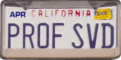

class: title-slide, center, middle
```{r, echo = FALSE, warning=F, message=FALSE}
# https://stackoverflow.com/questions/25646333/code-chunk-font-size-in-rmarkdown-with-knitr-and-latex
def.chunk.hook  <- knitr::knit_hooks$get("chunk")
knitr::knit_hooks$set(chunk = function(x, options) {
  x <- def.chunk.hook(x, options)
  ifelse(options$size != "normalsize", paste0("\\", options$size,"\n\n", x, "\n\n \\normalsize"), x)
})
library(rgl)
library(vegan)
library(ggplot2)
library(ggrepel)
```

```{r, echo = FALSE, results="asis"}
cat('# ', rmarkdown::metadata$title)
```

```{r, echo = FALSE, results="asis"}
cat('## ', rmarkdown::metadata$subtitle)
```

```{r, echo = FALSE, results="asis"}
cat('### ', rmarkdown::metadata$author)
```

```{r, echo = FALSE, results="asis"}
cat('#### ', rmarkdown::metadata$institute)
```

```{r, echo = FALSE, results="asis"}
cat(rmarkdown::metadata$date)
```
---

## Seriation: idea and basics [1]

.pull-left[
Types come into use, have a maximum and than disappear

- First Seriation: Sir William Flinders-Petrie 1899
- became very popular during Processual Archaeology
- First major trials with seriating methods in Germany Goldman 1979 with reciprocal averaging
]

.pull-right[

]

---
## Seriation: idea and basics [2]

.pull-left[
- Represent 'types' per 'object' in a table
- Sort the table so that a sequence (diagonal) appear

Methods:

- Reciprocal Averaging
- Correspondence Analysis

Necessary:

- two 'types' per 'object'
- two 'objects' per 'type'

]

.pull-right[

]

---
## First step

### Get the data out of the database in a useful form

- query
- pivot table

---
## Second step

### Remove non informative rows

- rows that have not artefact or only one

### Remove non informative columns

- columns that have not artefact or only one

### Repeat until no further step necessary

<hr>

## Commands in LibreOffice Calc (and Excel)

- COUNT (ANZAHL)
- COUNTIF (ZÄHLENWENN)

---

## Reciprocal Averaging: idea and basics

Produce a diagonal in such a way, that all objects and types are ranked relational

- Calculate rank for rows
- Sort rows according to rank
- repeat the same for columns
- repeat both until no further changes

Iterative procedure

[Example Dataset](data/ra_example.csv)

---

## Correspondence analysis: idea and basics [1]

### Similar things have similar characteristics...[2]
**Visual explorative/descriptive method**

- Correspondence analysis does not work with significances, therefore it does not 'proof' anything
- Visualization of contingency tables or presence/absence matrices

**Idea**

- Representation of items (*sites*) and properties (Variables, *species*) in a common space (coordinate system)
- Data that is related to each other is more closely related represented next to each other
- Similarities are calculated using chi-square methods

**Prerequisites**

A data matrix with at least nominally scaled variables, therefore especially suitable for archaeological questions

---

## Correspondence analysis: idea and basics [1]

### Similar things have similar characteristics...

**General procedure**
- Standardizing the data to a comparable measure
- "Projection" of the data into a multidimensional variable space
- determining the vectors which stepwise contain most of the information (variability) of the data and are oriented perpendicular to each other
- "Projection" of the data onto these vectors
- Representation of the position of the data on these vectors in a diagram

---
.pull-left[
### multidimentional data space


.caption[.tiny[source: http://www.aapspharmscitech.org]]
]

.pull-right[

### projection of points onto a plane

.caption[.tiny[source: http://www.cs.mcgill.ca]]
]
---

## Correspondence Analysis: History

### General information
- Development in the field of biology and psychology
- Algebrarian Foundations 1940s (Hartley/Guttman)
- First explicit use by Benzéncri in the 1960s linguistic studies
- Further development in various research groups → resulted in different versions and names of the procedure
- 1984 Greenacre basic monograph on the method

### In archaeology
- Wide application of the procedure for chronological sorting of the Rhineland Linear Pottery
- Continuation by institutes Cologne and Kiel (Zimmermann, Müller)

---

## Correspondence Analysis: Procedure

### Preparation: contingency table, if necessary
**Presence Absence Matrix**

Notes the presence or absence of a characteristic for a unit, which is the most widely used base in archaeology

|         | Pot | Cup | Fibula | Sum |
|---------|-----|-----|--------|-----|
| Burial1 | 1   | 1   | 0      | 2   |
| Burial2 | 0   | 1   | 1      | 2   |
| Burial3 | 1   | 1   | 1      | 3   |
| Burial4 | 1   | 0   | 1      | 2   |
| Sum     | 3   | 3   | 3      | 9   |

Prerequisite: total number of filled cells per column at least 2, total per row at least 2

---

## Preparation: contingency table, if necessary
### contingency table

Notes the number of a characteristics for a unit or a group of units


|             | Pot | Cup | Fibula | Sum |
|-------------|-----|-----|--------|-----|
| Settlements | 20  | 23  | 40     | 83  |
| Hoards      | 23  | 10  | 6      | 39  |
| Burials     | 10  | 56  | 4      | 70  |
| Sum         | 53  | 89  | 50     | 192 |

Also possible: Burt-Matrix, if you want, you can ask me for details after the lecture...

---

## Correspondence analysis: Procedure (using a presence/absence matrix)

### Preparation: Standardising to relative frequency
Calculation: Divide each cell by the total sum
.tiny[
.pull-left[
```{r echo=F}
my_data <- matrix(c(1, 1, 0, 0, 1, 1, 1, 1, 1,1, 0, 1), byrow = T,ncol=3)
colnames(my_data) <- c("pot", "cup", "fibula")
rownames(my_data) <- paste0("burial",1:4)
write.csv(my_data, file = "burials.csv")
my_m_table <- addmargins(my_data)
knitr::kable(my_m_table, format = "html")
```
]

.pull-right[
```{r echo=F}
p <- my_data/sum(my_data)
my_prop_mtable <- addmargins(p)
knitr::kable(round(my_prop_mtable,2), format = "html")
```
]
]

Margins of the table stored for calculation of expectation values and scaling the result later on

---

## Correspondence analysis: Procedure (using a presence/absence matrix)

### Preparation: Calculation of expected values

.pull-left[
```{r echo=F}
knitr::kable(round(my_prop_mtable,2), format = "html")
```
]
.pull-right[
```{r echo=F}
e <- rowSums(my_data) %*% t(colSums(my_data)) / sum(my_data)^2
knitr::kable(round(addmargins(e),2), format="html")
```
]

---

## Correspondence analysis: Procedure (using a presence/absence matrix)

.pull-left[
### Preparation: Calculation of standardised values

$\chi^2=\sum_{i=1}^n \frac{(O_i - E_i)^2}{E_i}$

$z_{ij}=\frac{(O_i - E_i)}{\sqrt{E_i}}$

```{r echo=F}
z <- (p - e)/sqrt(e)
write.csv2(z, file = "burial_z.csv")
knitr::kable(round(addmargins(z),2), format="html")
```
]

.pull-right[
### Inertia

Measurement for the spread of the data in relation to the number of cases

$I = \frac{\chi^2}{n} = \sum_i \sum_j z_{ij}^2$

Inertia here: `r sum(z^2)`
]

---

```{r echo=FALSE}
plot3d(z[,1], z[,2], z[,3], type="s", size=1, lit=TRUE)
text3d(z[,1], z[,2], z[,3], rownames(z))
rglwidget()
```

---

.pull-left[
### multidimentional data space


.caption[.tiny[source: http://www.aapspharmscitech.org]]
]

.pull-right[

### projection of points onto a plane

.caption[.tiny[source: http://www.cs.mcgill.ca]]
]
---

## Correspondence analysis: Procedure (using a presence/absence matrix)

### Extraction of dimensions
**SVD**

**S**ingular **v**alue **d**ecomposition, method for dimensional reduction with minimal loss of information


$Z=U∗S∗V'$
.tiny[
Z : Matrix with the standardized data

U : Matrix for the row elements

V : Matrix for the column elements

S : Diagonal matrix with the singular values
]


.caption[.tiny[Gene Golub’s license plate, photographed by Professor P. M. Kroonenberg of Leiden University.]]

---
## Correspondence analysis: Procedure (using a presence/absence matrix)

### Extraction of dimensions

**SVD in R**
.tiny[
```{r}
burial.z<-read.csv2("burial_z.csv",row.names=1)
burial.svd<-svd(burial.z)
burial.svd
```
]

---
## SVD and Inertia

The singular values (eigenvalues) represent the inertia.

.tiny[
The eigenvalues
```{r}
burial.svd$d
```

The squared eigenvalues are the inertia of the individual dimensions
```{r}
burial.svd$d^2
```

The sum of the squared eigenvalues is equal to the total of the intertia.
```{r}
sum(burial.svd$d^2)
```

If the inertia of the individual dimensions is divided by the total inertia, the (eigenvalue) proportion of the dimensions is obtained.

```{r}
burial.svd$d^2/sum(burial.svd$d^2)
```
]

---
## Correspondence analysis: Procedure (using a presence/absence matrix)

### Normalization of coordinates
Scaling of the coordinates in such a way that

The dimensions are weighted according to their proportion of the total inertia.

The rows/columns are weighted according to their proportion of the mass.

---

## Correspondence analysis: Real World case

### Münsingen Burial Site

.pull-left[
.small[
```{r eval=F}
muensingen <- read.csv("muensingen_ideal.csv",
                       row.names = 1)
muensingen.cca <- cca(muensingen)

muensingen.species <- data.frame(
  scores(muensingen.cca)$species
  )
ggplot(muensingen.species,
       aes(x=CA1,
           y=CA2,
           label=rownames(muensingen.species)
           )
       ) +
  geom_point() + geom_text_repel(size=2)
```
]
]

.pull-right[
```{r echo=F, message=F, warning=F, fig.retina = 2}
muensingen <- read.csv("data/muensingen_ideal.csv", row.names = 1)
muensingen.cca <- cca(muensingen)
library(ggplot2)
library(ggrepel)

muensingen.species <- data.frame(
  scores(muensingen.cca)$species
  )
ggplot(muensingen.species,
       aes(x=CA1,
           y=CA2,
           label=rownames(muensingen.species))) +
  geom_point() + geom_text_repel(size=2)
```
]

---
## Correspondence analysis: Real World case

### Münsingen Burial Site

.pull-left[

]

.pull-right[

]

[http://tosca.archaeological.science](http://tosca.archaeological.science)
---

## Correspondence Analysis: Interpretation

### Guttman effect (horseshoe, parabola)

.pull-left[
In archaeology, this is often regarded as evidence of a temporal orientation.

The Guttman effect occurs when a process affects the data on multiple levels.

The largest influencing factor, given a longer runtime, is mostly the time, but:

This does not always have to be the case.

Check against other information necessary.
]

.pull-right[
```{r echo=F, message=F}
muensingen.sites <- data.frame(scores(muensingen.cca)$sites)
ggplot(muensingen.sites,aes(x=CA1,y=CA2,label=rownames(muensingen.sites))) + geom_point()
```
]
---
class: inverse, middle, center
# Any questions?

.footnote[
.right[
.tiny[
You might find the course material (including the presentations) at

https://berncodalab.github.io/caa

You can contact me at

<a href="mailto:martin.hinz@iaw.unibe.ch">martin.hinz@iaw.unibe.ch</a>
]
]
]
