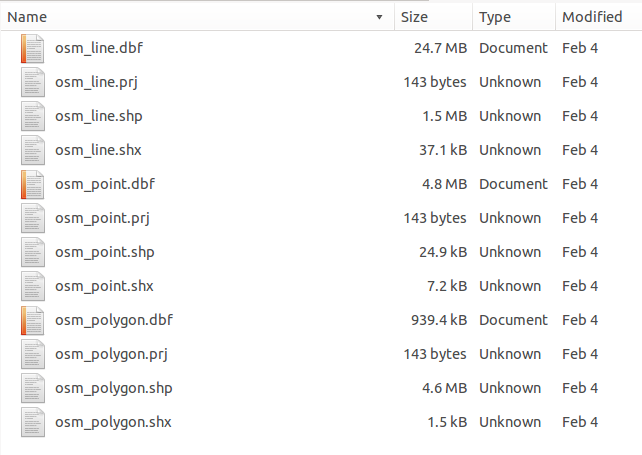
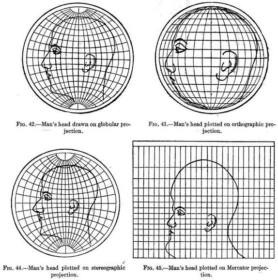
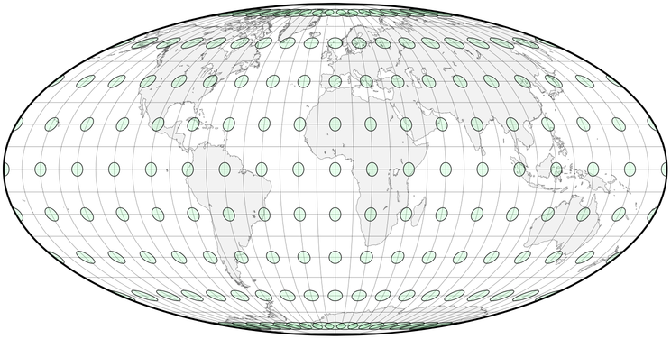
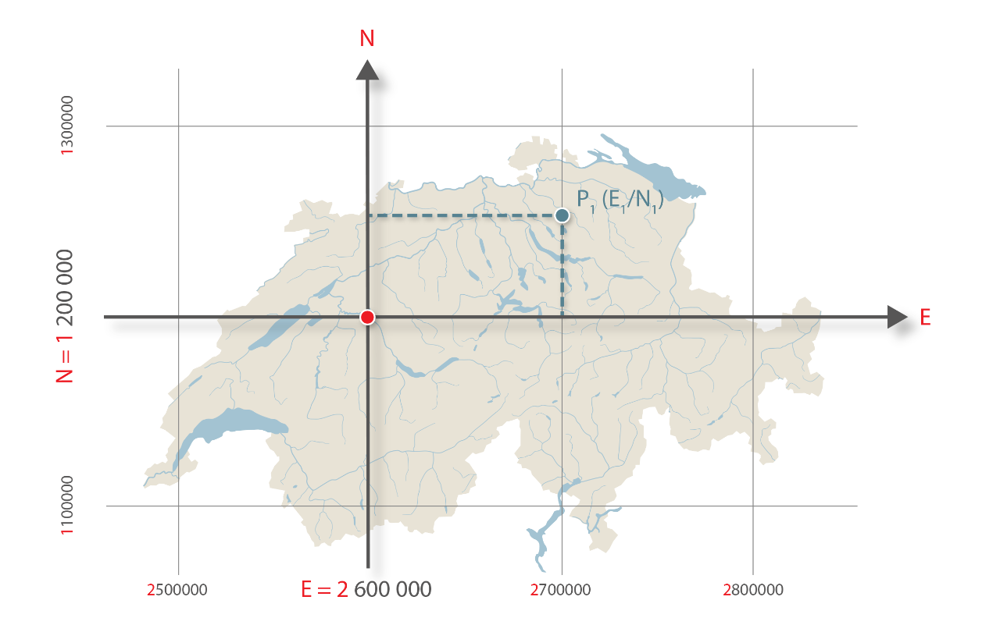
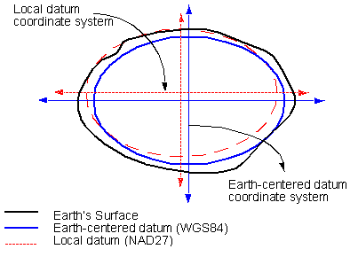

class: title-slide, center, middle
```{r, echo = FALSE, warning=F, message=FALSE}
# https://stackoverflow.com/questions/25646333/code-chunk-font-size-in-rmarkdown-with-knitr-and-latex
def.chunk.hook  <- knitr::knit_hooks$get("chunk")
knitr::knit_hooks$set(chunk = function(x, options) {
  x <- def.chunk.hook(x, options)
  ifelse(options$size != "normalsize", paste0("\\", options$size,"\n\n", x, "\n\n \\normalsize"), x)
})
library(magrittr)
library(kableExtra)
```

```{r, echo = FALSE, results="asis"}
cat('# ', rmarkdown::metadata$title)
```

```{r, echo = FALSE, results="asis"}
cat('## ', rmarkdown::metadata$subtitle)
```

```{r, echo = FALSE, results="asis"}
cat('### ', rmarkdown::metadata$author)
```

```{r, echo = FALSE, results="asis"}
cat('#### ', rmarkdown::metadata$institute)
```

```{r, echo = FALSE, results="asis"}
cat(rmarkdown::metadata$date)
```
---
class:center,middle
# Why Do We Create Maps?

---
class:center,middle
## Types of Maps

---

## General Reference Maps

--

+ Show important physical features of an area
--

+ Include natural and man-made features
--

+ Usually meant to help aid in the navigation or discovery of locations
--

+ Usually fairly simple
--

+ Can be stylized based on the intended audience (tourists vs locals)

---

class:center,middle

#####Source: https://map.schweizmobil.ch/
---

## Thematic Maps

--

+ Focuses on a specific theme or subject area
--

+ Features on the map represent the phenomenon being mapped
--

+ Spatial features used for reference

---
class:center,middle

## Distribution Map


.caption[Source: Steuer 1998]
---
class:center,middle
## "Cultural" Map


.caption[Terberger et al. 2014]
---
class:center,middle
## "Genetic" Map


.caption[Kayser et al. 2005]
---

class:center,middle,inverse
# Basic Map Elements

---
class:center,middle

## Points  

.caption[http://docs.qgis.org/2.8/en/docs/gentle_gis_introduction/vector_data.html#overview]

---
class:center,middle

## Lines

.caption[http://docs.qgis.org/2.8/en/docs/gentle_gis_introduction/vector_data.html#overview]

---
class:center,middle

## Polygons

.caption[http://docs.qgis.org/2.8/en/docs/gentle_gis_introduction/vector_data.html#overview]

---

class:center,middle
# How do we make maps?

---
## GIS [1]

.pull-left[

> A geographic information system (GIS) is a system designed to capture, store, manipulate, analyze, manage, and present spatial or geographic data. - Wikipedia

]

.pull-right[

]
### Or more simply

> In a GIS, you connect _**data**_ with _**geography**_.
[GISgeography.com](http://gisgeography.com/what-gis-geographic-information-systems/)
---

## Geographic Information Systems (GIS)
--

+ Create interactive queries (user-created searches)
--

+ Analyze spatial information
--

+ Edit data in maps
--

+ Present the results of all these operations

.right[

]

---

## What can we do with a GIS?


---
## GIS is relevant
.pull-left[
It might become your job, or at least an important part of it...
]

.pull-right[

]
---
## QGIS

- a free and open source GIS software
- https://www.qgis.org/
- If you not have already installed QGIS, please do now!

.center[

]

.right[

]
---
## Layers


#### Image Source: http://www.geocontrolling.com/co-je-gis.htm

---
## Raster vs. Vector

.pull-left[

]
.pull-right[

]
---
## Raster (files)

--
.pull-left[
+ essentially an image with geographic information, which is georefenced
+ mostly used for background maps
+ can also contain continouus spatial information (altitude, precipitation, site density, ...)
+ Multiple formats are available (.img, .grid, .tiff, ...)
+ GeoTiffs are a quasi standard
]

--
.pull-right[

]

---
## Shapefiles
--
        
+ Basic file for storing map elements
--

+ Stores spatial data, like points, lines, and polygons
--

+ Multiple files comprise a "shapefile"

--


---

## Shapefiles


--

+ .shp—The main file that stores the feature geometry
--

+ .dbf—The dBASE table that stores the attribute information of features

---

## Shapefiles


+ .prj—The file that stores the coordinate system information
--

+ .shx—The index file that stores the index of the feature geometry

---

## You might also see
--

+ .cpg—Identifies the character set to be used
--

+ .sbn and .sbx—The files that store the spatial index of the features

---

## Shapefiles

+ Have a few limitations
--

+ One geometry type (Point, Line, Polygon) per shapefile
--

+ So sometimes you end up with this:


---
## Coordinates

.pull-left[
Lat/long system measures angles on spherical surfaces

* 60º east of PM
* 55º north of equator

* Lat/long values are NOT Cartesian (X, Y) coordinates
* constant angular deviations do not have constant distance deviations
* 1° of longitude at the equator ≠ 1° of longitude near the poles

A basic Coordinate Reference System
]

.pull-right[

]
---

class:center,middle
# So what is a Coordinate Reference System?

---

## Projections
--

+ No one's favorite part of GIS
--

+ But a necessary part of it nonetheless
--

+ Convert points on the 3-dimensional Earth (**latitude** and **longitude**) to x and y coordinates on a 2-dimensional map

--


[Digital Coast Geozone](https://geozoneblog.wordpress.com/2012/05/22/happy-birthday-mercator/)

---
## Coordinate Reference Systems

.pull-left[
- Features on spherical surfaces are not easy to measure
- Features on planes are easy to measure and calculate
  - distance
  - angle
  - area
- Coordinate systems provide a measurement framework
]

.pull-right[

]

---
## Coordinate Systems and Projection [1]

.pull-left[

]
.pull-right[

]

---
## Coordinate Systems and Projection [2]

.pull-left[
- an imaginary light is “projected” onto a “developable surface” 
- a variety of different projection models exist
- Map projections always introduce error and distortion
]

.pull-right[

]
---

## Projections
+ Every projection distorts some part of your map



[FlowingData](http://flowingdata.com/2014/01/13/map-projections-illustrated-with-a-face/)

---

## Projections Matter
--

+ These circles are all the same size on the globe:


[Progonos](http://www.progonos.com/furuti/MapProj/Normal/CartProp/Distort/distort.html)

---

## Projections Matter
+ As are these:


[Progonos](http://www.progonos.com/furuti/MapProj/Normal/CartProp/Distort/distort.html)

---

## Projections Matter
+ And these:


[Progonos](http://www.progonos.com/furuti/MapProj/Normal/CartProp/Distort/distort.html)

---

## Projections Matter


---

## Mercator Projections
--

+ A common map projection
--

+ Makes geometries near poles look bigger than geometries near the equator
--


---
## UTM

.pull-left[
Universal Transverse Mercator (UTM)

- Based on the Transverse Mercator projection
- 60 zones (each 6° wide)
- false eastings
- Y-0 set at south pole or equator
]

.pull-right[

]

---
## Schweizer Landeskoordinaten

.pull-left[
- a geographic coordinate system used in Switzerland for maps and surveying by the Swiss Federal Office of Topography (Swisstopo)
- The map projection used is Oblique Mercator on an 1841 Bessel ellipsoid.
- All coordinates are always positive, since Switzerland is located in the 1st quadrant of the coordinate system.
]

.pull-right[

]
---
## Datums and Ellipsoids

.pull-left[
- The earth is essentially a potatoe...
- Ellipsoids are geometric estimations of the shape of the earth with more or less accurary
- a datum is a system that allows us to place a coordinate system on the earth’s surface based on a specific ellipsoid
- examples:
  - WGS84 (Lat/Lng, UTM)
  - Bessel 1841 (Schweizer Landeskoordinaten)
]

.pull-right[

]
---

## Projections
+ Identified by unique IDs (**EPSG**) that make it easier to talk about them

+ EPSG: European Petroleum Survey Group Geodesy (it was introduced, because Oil companies were annoyed by the incredible number of different systems)

--
+ WGS 84 is referred to as **EPSG:4326**

--
+ Google Maps and other online sources often uses WGS 84 / Pseudo-Mercator (**EPSG:3857**)

--
+ CHTRS95 is referred to as **EPSG:2056**

--

## Remember these three and you should be set

---
## Georeferencing
.pull-left[
The process of orienting a image in geographical space

* Every map comes with its own projection. Sometimes known, more often not

* Every mapping results in errors or imprecision. Every digitalisation adds errors up to that.

* Scale matters: digitised information on large scale might be precise enough, on small scale not. It is necessary to keep meta-data to know how the data were digitised (on what scale) to be able to understand on what scale they might be used.
]

.pull-right[


]


---
## Digitising

.pull-left[
The process of attaching geocoordinates to points on georeferenced maps

Rather straight forward:

* You have a layer of a certain geometry
* You make it editable
* You click on the feature of the scanned map
* You specify additional information for that point
* Rinse and repeat
* Finally, save the layer
]

.pull-right[

]

---
class: inverse, middle, center
# Any questions?

.footnote[
.right[
.tiny[
You might find the course material (including the presentations) at

https://berncodalab.github.io/caa

You can contact me at

<a href="mailto:martin.hinz@iaw.unibe.ch">martin.hinz@iaw.unibe.ch</a>

* Steiniger 2009, Free and Open Source Desktop GIS Projects and Software
* Briggs 2019, GIS Fundamentals
* Leeds, Raster GIS
* Lawler/Schiess 2010, Projections and Coordinate Systems
]
]
]
