class: title-slide, center, middle
```{r, echo = FALSE, warning=F, message=FALSE}
# https://stackoverflow.com/questions/25646333/code-chunk-font-size-in-rmarkdown-with-knitr-and-latex
def.chunk.hook  <- knitr::knit_hooks$get("chunk")
knitr::knit_hooks$set(chunk = function(x, options) {
  x <- def.chunk.hook(x, options)
  ifelse(options$size != "normalsize", paste0("\\", options$size,"\n\n", x, "\n\n \\normalsize"), x)
})
library(magrittr)
library(kableExtra)
```

```{r, echo = FALSE, results="asis"}
cat('# ', rmarkdown::metadata$title)
```

```{r, echo = FALSE, results="asis"}
cat('## ', rmarkdown::metadata$subtitle)
```

```{r, echo = FALSE, results="asis"}
cat('### ', rmarkdown::metadata$author)
```

```{r, echo = FALSE, results="asis"}
cat('#### ', rmarkdown::metadata$institute)
```

```{r, echo = FALSE, results="asis"}
cat(rmarkdown::metadata$date)
```
---
## Isotopes I

.pull-left[

- many elements exist in more than one form: Isotopes
- 'ı́sos' means equal, 'tópos' means place, since all isotopes of an element are in the periodic table in the same position
- term (1913) originates from Frederick Soddy (1877-1956, Nobel Prize for the discovery in 1921)
- each natural element has 1 or more stable isotopes
- unstable isotopes are radioactive because they decay and emit radiation

]

.pull-right[
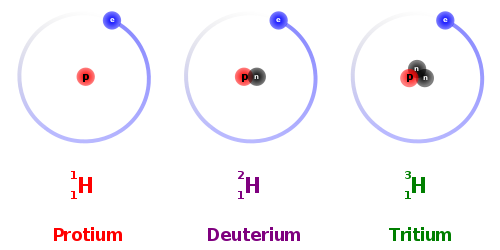
.caption[source: https://commons.wikimedia.org/wiki/File:Hydrogen_Deuterium_Tritium_Nuclei_Schmatic-en.svg]
]
---
## Isotopes II

.pull-left[

- Isotopes differ by mass number
- Mass number is the number of nucleons (heavy nucleons, protons and neutrons).
- element defined by atomic number, i.e. how many protons (and thus electrons) are present
- Variable within an element (and thus forming the isotopes) are different neutron numbers

atomic number is given at the bottom left according to the convention, e.g. <sub>6</sub>C for carbon, but is usually omitted, since the element symbol generally indicates a fixed number anyway

Mass number is given at top left according to convention, e.g. <sup>14</sup>C for carbon 14

possible also both together, e.g. $^{14}_6C$ for carbon 14
]

.pull-right[
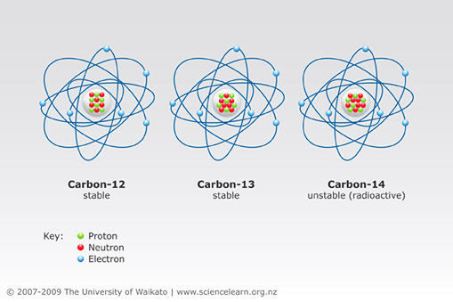
.caption[Carbon isotopes (www.sciencelearn.org.nz)]
]
---
class: inverse
## small test

What means this:

$^{16}_8O$

--

Oxigen

--

atomic number 8: 
--
8 protons and 8 electrons

--

mass number 16: 
--
8 protons and 8 neutrons

--

ordinary Oxygen
---
## Carbon Isotopes

$^{12}$C: Ordinary carbon (About 99% of the total carbon)

stable isotope: $^{13}$C (About 1% of the total carbon)

unstable isotopes:

$^{10}$C Half-life: 19.255 s

$^{11}$C Half-life: 20.39 min

$^{15}$C Half-life: 0.747 s

$^{14}$C Half-life: 5730 years

$1.5 x 10^{12}$ atoms $^{12}$C 1 atom $^{14}$C

Stolen comparison:

If 5 detached houses were filled with sand, a single grain of sand would be different!

---
## Radioactive decay

- as a nuclear-physical process completely independent of external influences
- No matter in which compound radioactive isotope is present, how high the temperature or the pressure is, where on earth or in the atmosphere isotope is located

### half-life period
.pull-left[
The time in which a exponential decreasing value has halved over time.

In our case: where only half of the original material (decaying isotopes) is still present.

- after 1st half-life: 1/2
- after 2nd half-life: 1/4
- ...
- after the 8th half-life? 1/256

Ex. $^{14}$C: after 10 half-lives (57300 years) only 1/1024 $^{14}$C left
]

.pull-right[
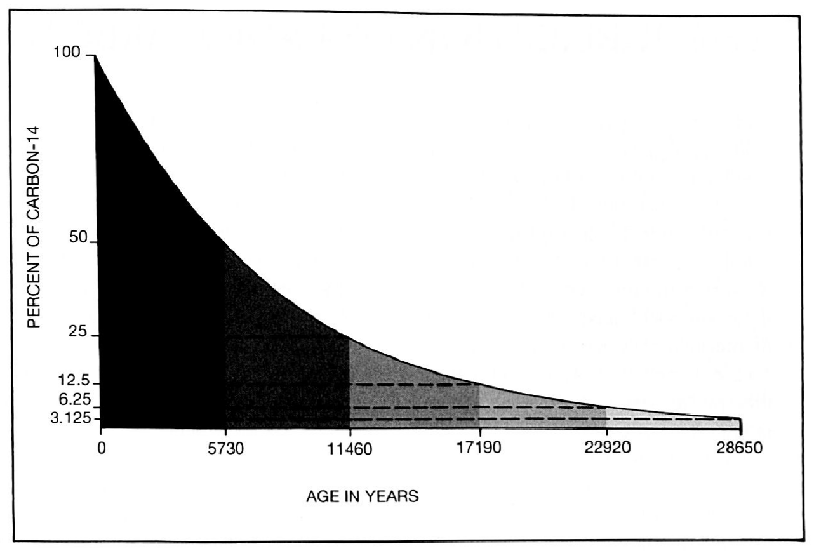
.caption[radiocarbon decay (Renfrew/Bahn 2008, 147)]
]
---
## Different 'archaeologically interesting' half-lives

- Uranium $^{238}$U: 4.5 billion years
- Uranium $^{235}$U: 704 million years
- Potassium $^{40}$K: 1.25 billion years
- Argon $^{40}$Ar: 269 years
- Carbon $^{14}$C: 5730 years
- ...

### Why can one calculate with half-lives?

Radioactive substances decay purely by chance!

but per isotope with different probability (certain average lifetime)

There are many decay occurrences per time unit

1 g pure 14 C: 5,203,356,172,191,460,000 Decays/s

1 g fresh carbon mix: approx. 5,000,000 decays/s

Law of the large number: The more random events, the closer the result is to the mean value
---
## quintessence

Radioactive substances disintegrate very evenly on average: Excellent stopwatch!

The more there is, the better the stopwatch: a reason why uncertainty increases with old samples (but not the most serious one).

It becomes exponentially less: another reason why uncertainty increases with old samples.

### Task

- Find a radioactive substance having a reasonable half-life for the dating problem which is connected to the event to be dated in a meaningful way
- Procure complex devices for measurement!

---
## Measuring error with radiometric dating I

.pull-left[
Measured values always deviate around an (actual) mean value, generally 'normally distributed'

Error is generally given in units/'standard deviation'.

1 standard deviation (1 sigma / σ) means: the actual value lies within the specified range with a 68.3% probability.

2 σ: 95.4% Probability

3 σ: 95.4% probability
]

.pull-right[

.caption[Normal distribution and standard deviations (de.wikipedia.org)]
]
---
## Measuring error with radiometric dating II

Measurements usually have a fixed standard deviation for the error

Example: When stopping a running time it does not matter whether 100m run or 10km run, the inaccuracy when pressing the stopwatch will be about the same

more specific example:
Accelerator has accuracy of ± 200 atomic nuclei

Measurement of 40,000 atomic nuclei

σ= 200 = 0.5% of measured value

1 half-life (20,000):

σ= 200 = 1% of the measured value

2 half-lives (10,000):

σ= 200 = 2% of the measured value

5 half-lives (1250):

σ= 200 = 16% of the measured value

---
## $^{14}$C, the beginning

.pull-left[
has been known as an isotope for a long time

- Early 30s:
  - short-lived (HL 1-1000 years)
  - not naturally occurring
- Ernest O. Lawrence (1939 Nobel Prize in Physics)
  - longer HL (>1000 years)
  - Production by neutron adsorption on $^{14}N$
- Serge Korff (30s)
  - experiments with ballons
  - neutrons from cosmic radiation
  - $^{14}$C as naturally occurring isotope in the atmosphere
]

.pull-right[
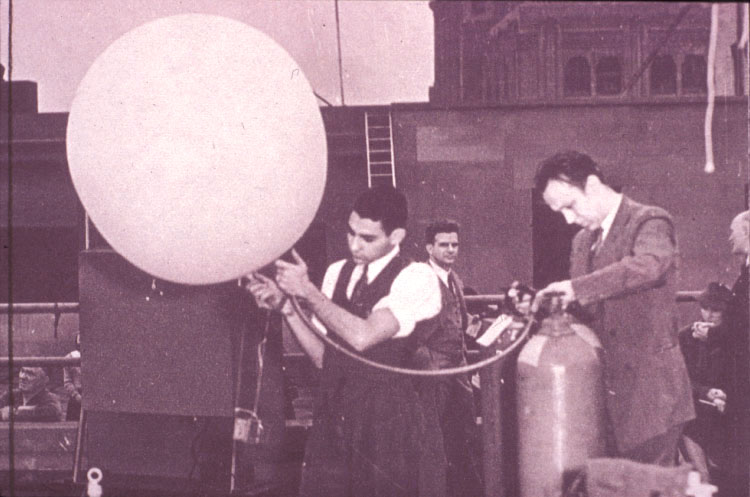
.caption[high altitude balloon]
]
---
##  Libby

.pull-left[
- Built the 1st Geiger counter in the United States.
- he also believed: Neutrons as triggers $^{14}$C
- HL $^{14}$C 10³ - 10⁵
- Special construction of Geiger counters
]
.pull-right[
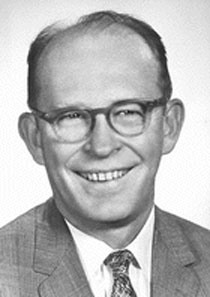
.caption[Willard Libby]
]
---
## The basic concept

.pull-left[
Basic formulation of idea $^{14}$C-dating in 1939

- $^{14}$C production in the atmosphere
- uptake by metabolism
- decay after death
]

.pull-right[
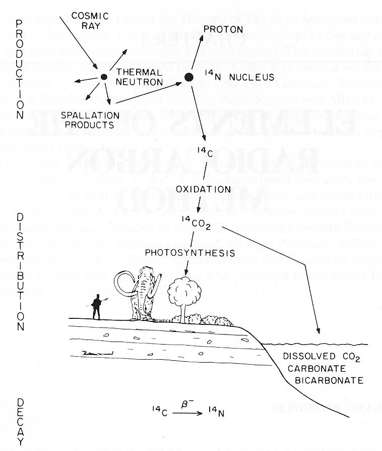
.caption[carbon cycle after Libby (Tailor 1999)]
]
---
## The first calibration curve
.pull-left[
Dating of Djoser revealed: 3979±350 BP
(average of 3 dates 3699±770, 4234±600, 3991±500)

Historical Age: 4650±75 BP

Based on 6 other samples of known age, he constructed the first 'calibration curve

$^{14}$C-HL there: 5720±47 years

Critical experiments were successful

Accuracy at ±10%.

Basic publication:
Arnold / Libby, Age determinations by radiocarbon content: checks with samples of known age. Science, 1949.

The beginning of $^{14}$C dating.
]

.pull-right[
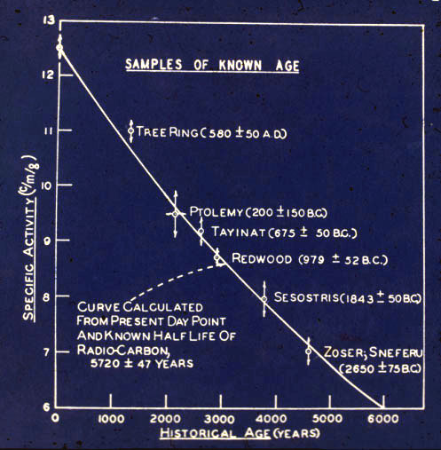
.caption[calibration curve by Libby]
]
---
## Discovery of the Necessity to Calibrate

in the 1960s, systematic errors in the dating of ancient Egypt were noticeable due to improved counting accuracy of the equipment

Libby first suggested the Egyptologists were wrong with dating according to the old scheme

The $^{14}$C-discussion still suffers from this to some extent today.

first tests on dendro series confirmed systematic error

---
## Development of the calibration curve

.pull-left[
Beginning of the distinction between " $^{14}$C years " and "solar years"

first continuously detailed and documented series showed different effects in 1970 (Suess):
- larger effects or long-term trends
- Complex coexistence of different short-term influences
]
.pull-right[
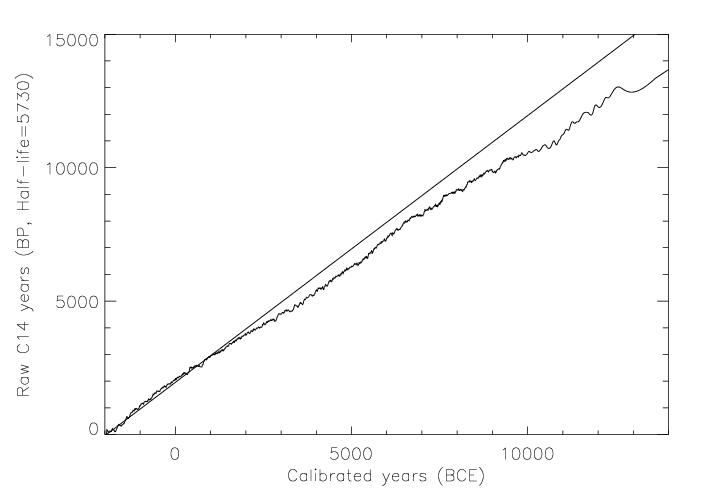
]
---
## Production

.pull-left[
Occurs in the upper atmosphere due to cosmic rays.
Nitrogen is converted to 14 C by the addition of a neutron and the subsequent repulsion of a proton.

14 N + 1 n → 14 C + 1 p

Decays with half-life 5730 years again in the atmosphere
Production and decay are in equilibrium (ratio stable)
]

.pull-right[
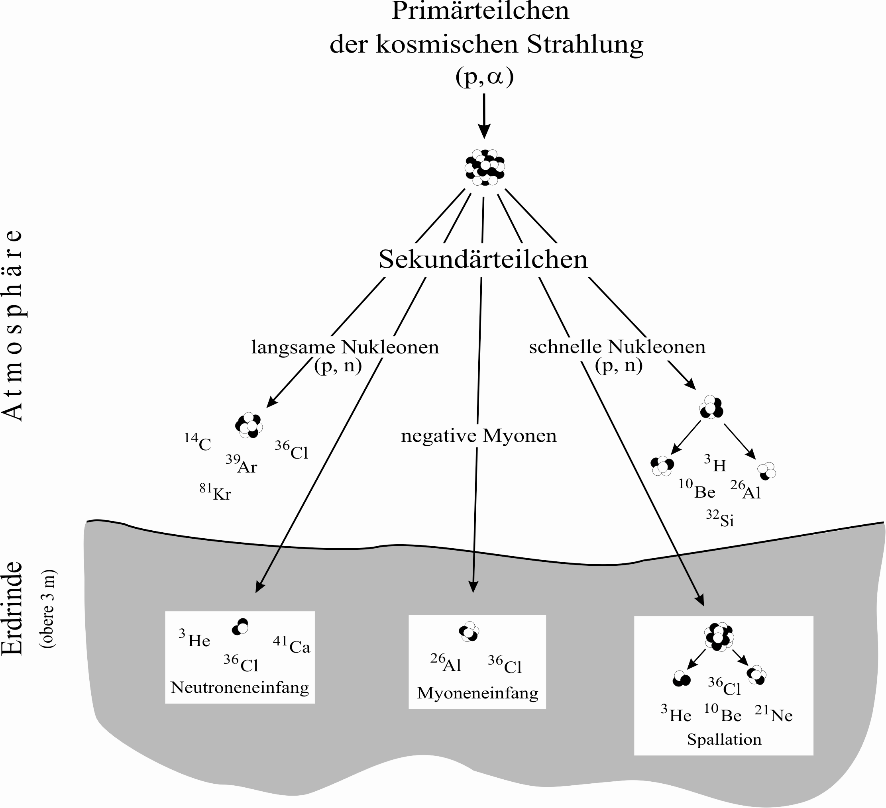

]
---
## 'Ingestion' during the lifetime

.pull-left[
- Plants metabolize CO $_2$ from the air
- the content of $^{14}$C in live plants is stable due to permanent intake
- the content of $^{14}$C in herbivores is also stable due to permanent consumption of plants
- the content of $^{14}$C in carnivores is also stable due to permanent consumption of herbivores
]

.pull-right[
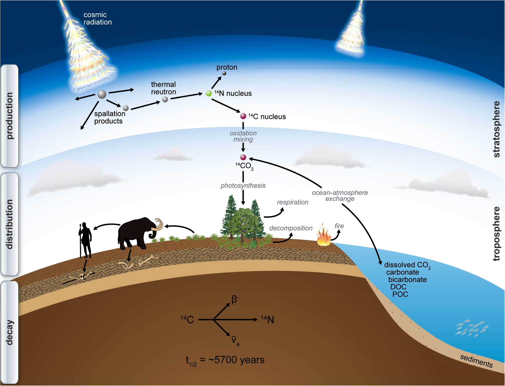
.caption[source: http://www.imprs-gbgc.de/uploads/RadiocarbonSchool/Overview/radiocarbon.png]
]
---
## Decay

With a half-life of 5730 years, 14 C decays to nitrogen (beta decay)

$^{14}$C  → $^{14}$N + 0 e - + v

- Decay already occurs in the living organism, but the ratio is balanced by metabolism
- Without metabolism no compensation
- Ratio $^{14}$C / $^{12}$C  changes due to decay from death:
-> **Dating**


---
## Calibration (without calibration curve) I

.pull-left[
Decay as an exponential process

We're not going deep here, but:

Many exponential processes are described by Euler's number as basis:

e=2,71828...

Let the amount of the $^{14}$C-atoms at death (t=0): $N_0$

After a half-life of t=5730, only $N_0$/2 atoms are still present.

It can be written as a general expotential function:

$N_t = N_0 ∗ e^{tk}$, where k is the specific constant for the individual decay of individual isotopes
]

.pull-right[

```{r, echo = FALSE, results="asis"}
x = 1:200000
y = exp(-0.000121*x)
plot(x,y,type="l", xlab="Jahre vor heute", ylab="Expotentielle Abnahme", ylim=c(0,1))
```

]
---
## Calibration (without calibration curve) II

.pull-left[
If we use our half-life, we can determine k for example:

$N_0/2 = N_0 ∗ e^{5730∗k} | : N_0 |ln$

$ln(1/2) = 5730k| : 5730$

$k=-0,000121$

Therefore, the calculation is for the 14 C decay:

$N_t = N_0 * e^{-0,000121∗t}$
]

.pull-right[

```{r, echo = FALSE, results="asis"}
x = 1:20000
y = exp(-0.000121*x)
plot(x,y,type="l", xlab="Jahre vor heute", ylab="Anteil 14C von ursprünglichen Wert", ylim=c(0,1))
abline(v=5730, col="red")
text(8000,0.5,label="50%", col="red", adj=c(0.5,-0.2))
abline(h=0.5, col="red")
text(5730,0.8,label="5730 (HW 14C)", col="red", adj=c(-0.1,.5))
```

]
---
## Calibration (without calibration curve) III

.pull-left[
If we now know the remaining share of $^{14}$C (e.g. 13.6%), we can calculate the age:

$N_t = N_0 * e^{-0.000121∗t}$

$13.6\% = 100\% ∗ e^{-0.000121∗t} | : 100|ln$

$ln(0.136) = -0.000121 ∗ t| : -0.000121$

$t=16488.433002034$

Proportions can be calculated by specific (radio)activity (conventional) or ratio 14 C/ 12 C compared to a standard sample.

If things were that simple in reality...
]

.pull-right[

```{r, echo = FALSE, results="asis"}
ratio_14C = 0.136
cal_ratio_14C = log(ratio_14C)/-0.000121
plot(x,y,type="l", xlab="Jahre vor heute", ylab="Anteil 14C von ursprünglichen Wert", ylim=c(0,1))
abline(v=cal_ratio_14C, col="red")
text(8000,ratio_14C,label=paste0(ratio_14C*100, " %"), col="red", adj=c(0.5,-0.2))
abline(h=ratio_14C, col="red")
text(cal_ratio_14C,0.8,label=round(cal_ratio_14C), col="red", adj=c(1.1,.5))
```

]
---
## Influences: earths magnetic field
.pull-left[
- Long-term changes correlate with changes in the Earth's magnetic field:
- Magnetic field deflects cosmic radiation
- When this changes, more or less cosmic radiation hits the atmosphere.
- This changes $^{14}$C production
]

.pull-right[
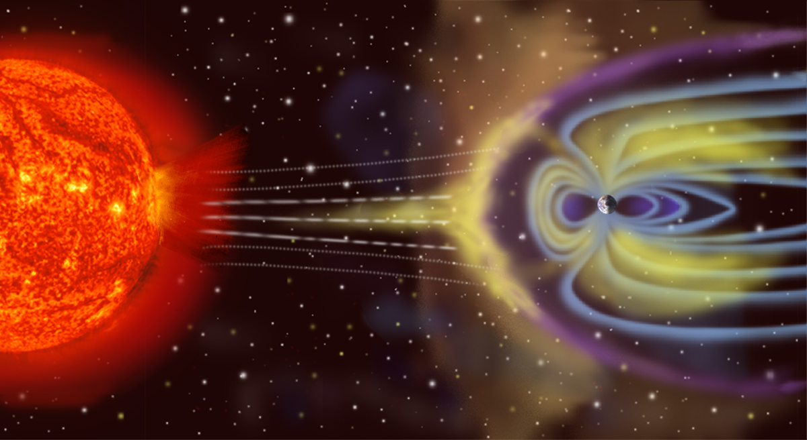
.caption[The magnetic field of the earth and the solar wind (nasa)]
]
---
## Influences: solar activities
.pull-left[
- Short-term changes are associated with changes in solar activity
- Sunspots Visible effects of change in solar activity
- 22-year cycle of more and less activity
- When this changes, more or less cosmic radiation hits the atmosphere.
- This changes $^{14}$C production

### multiple others

- burning/vulcanos/conventional fuel
- atomic bomb tests
- climatic change
- ...
]

.pull-right[
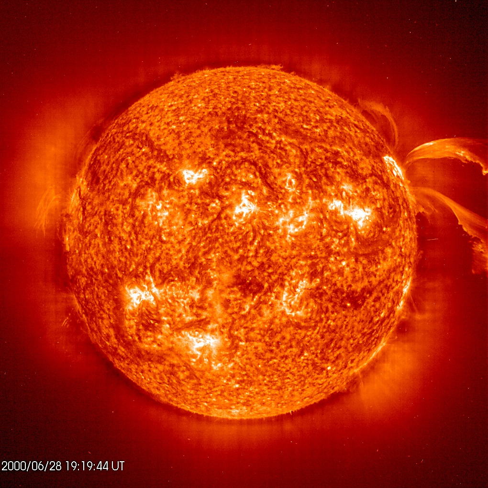
.caption[Solar activity and sunspots (www.uni-kiel.de)]
]

---
##How can the effects be countered?

### Option 1: Quantify all effects individually and create transfer formulas
- Elaborate mathematics
- Every mathematical formulation is a model, therefore only approximately
- Perhaps important factors are not taken into account
- We also do not know the solar/magnetic field/climate history in detail
### Option 2: Compare with things that are dated with certainty
- Idea: Determine the 14 C content, which is actually available in a certain solar year
- Everything can be done in one calculation
- All influences are taken into account automatically
- Empirical verification that the data is also correct

---
## Dendrodating as the basis for calibration
.pull-left[
- Tree rings are dated accurately to the year
- Tree rings consist of dead organic matter: 14 C-datable
- Several measurements are possible: Determination of the statistical error
]

.pull-right[
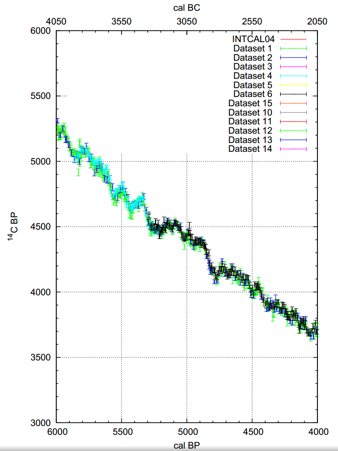
]
---
## What is the 'calibration curve'?

.pull-left[
- Calibration curve does not only consist of one BP value per BC value!
- Band of probabilities
- For each BP date, a mean value + scatter range with standard deviation
- Calibration with statistical software (R) or with specific calibration tools
  - CalPal
  - CalPal online
  - BCal
  - CALIB
  - OxCal
]

.pull-right[
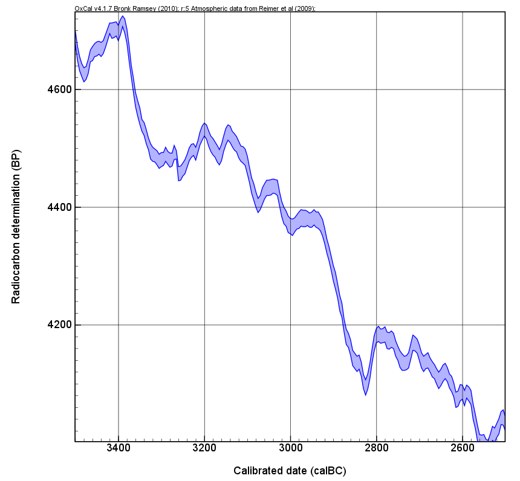

]
---
## OxCal

.pull-left[
Calibration program of the Oxford 14C Laboratory

Author: Prof. C. Bronk Ramsey

Different versions:

- OxCal online
- OxCal Distribution
  - for downloading on your computer
  - (it is currently rather difficult to set it up)
]

.pull-right[
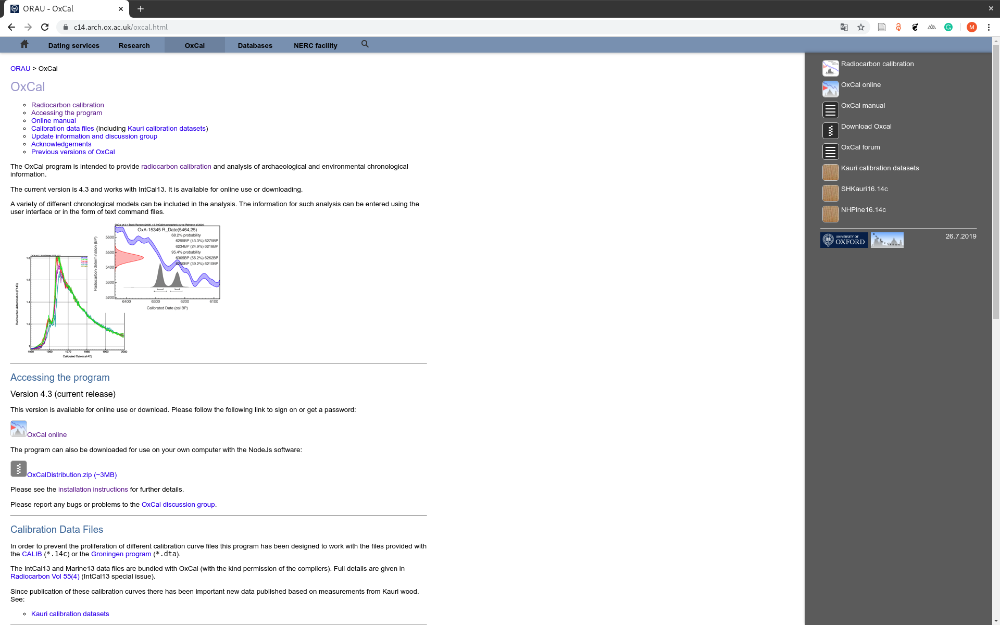
]

---
## OxCal
### first steps

.pull-left[
- Name
- Date
- ±
- Curve
- Calibrate
]

.pull-right[

]

---
## OxCal
### first result


.pull-left[
- Table
- Single Plot
- Multi-Plot (not very useful yet)
- Curve plot
- Raw Data
]

.pull-right[

]
---
## OxCal
### format result Single Plot


.pull-left[
- Show
  - Ranges
  - Summary statistics
  - Style
- Plot
  - Title
  - Ranges
  - Distribution
  - Curve
  - F14C
]

.pull-right[
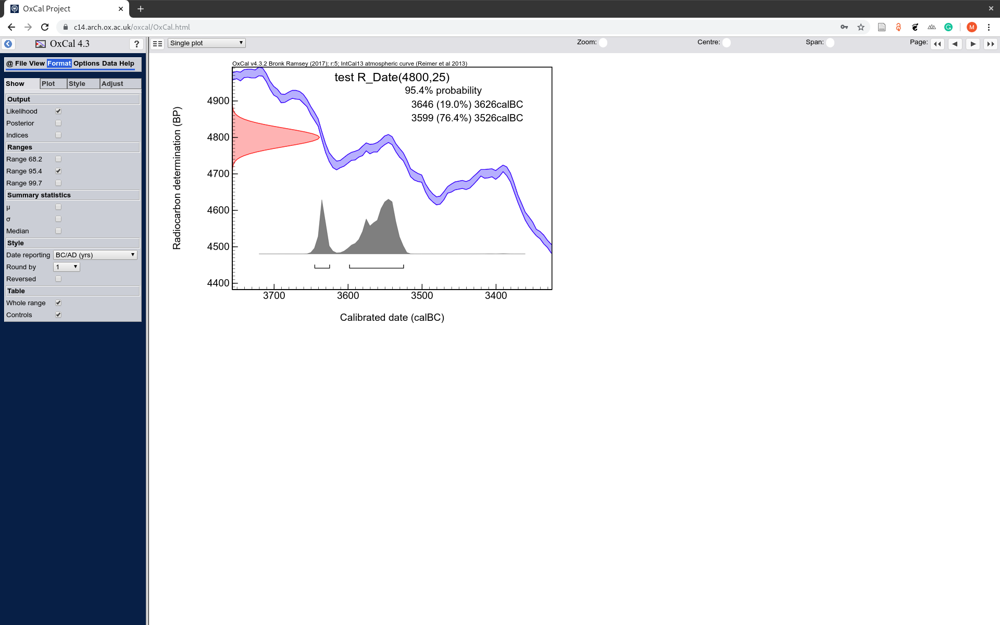
]
---
## OxCal
### format result


.pull-left[
- Style
  - Proportion place
  - B & W only
- Adjust
  - line spacing
  - text size^
  - Zoom
  - X Axis
  - Y Axis
]

.pull-right[
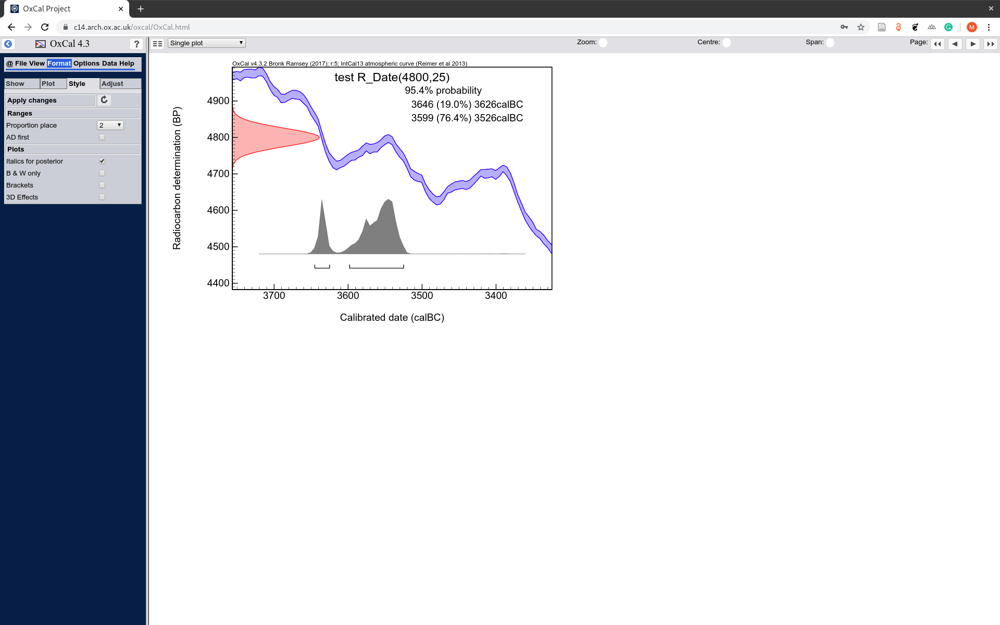
]
---
class: inverse, middle, center
# Any questions?

.footnote[
.right[
.tiny[
You might find the course material (including the presentations) at

https://berncodalab.github.io/caa

You can contact me at

<a href="mailto:martin.hinz@iaw.unibe.ch">martin.hinz@iaw.unibe.ch</a>

]
]
]
