class: title-slide, center, middle
```{r, echo = FALSE, warning=F, message=FALSE}
# https://stackoverflow.com/questions/25646333/code-chunk-font-size-in-rmarkdown-with-knitr-and-latex
def.chunk.hook  <- knitr::knit_hooks$get("chunk")
knitr::knit_hooks$set(chunk = function(x, options) {
  x <- def.chunk.hook(x, options)
  ifelse(options$size != "normalsize", paste0("\\", options$size,"\n\n", x, "\n\n \\normalsize"), x)
})
library(magrittr)
library(kableExtra)
```

```{r, echo = FALSE, results="asis"}
cat('# ', rmarkdown::metadata$title)
```

```{r, echo = FALSE, results="asis"}
cat('## ', rmarkdown::metadata$subtitle)
```

```{r, echo = FALSE, results="asis"}
cat('### ', rmarkdown::metadata$author)
```

```{r, echo = FALSE, results="asis"}
cat('#### ', rmarkdown::metadata$institute)
```

```{r, echo = FALSE, results="asis"}
cat(rmarkdown::metadata$date)
```
---
## Improving information gain using OxCal
### Precision

- Combine
- Wiggle Matching

### Derived information

- Summed Probability
- Duration

### Stratigraphical Modelling

- Sequential Calibration

---
## Combine

.pull-left[
- calculates the probability distribution for a specific event using multiple measurements
- goal: get a better estimation for the event by combining the dates
- is essentially similar to "measuring longer"

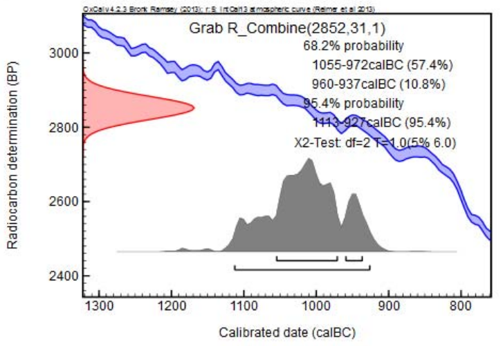
]

.pull-right[
- has a strong assumption:
  - all dates actually refer to the same event
- can actually only be used if the samples have been taken from the same object
  - Measurements from several bones of the same individual
  - Measurements of several grains from one depot
- is sometimes also done, but it is questionable:
  - Measurements of bones and grains from the same grave
  - Problem: Bones accumulate the 14C signal over a longer periode and do not precisely reflect the time of death!
]

---
## Combine
### An experiment

two measurements of the same bone of an individual, died 1950 (14C) years ago

Simulation in R:

```{r}
sample1 <- rnorm(1,1950, 25)
sample1
sample2 <- rnorm(1,1950, 25)
sample2
```
---
## Combine
### An experiment

.pull-left[
The Measurements will look like this
]

.pull-right[
```{r, echo=FALSE, warning=FALSE, message=FALSE}
dist_range <- 1800:2100
plot(dist_range, dnorm(dist_range, mean = sample1, sd=25), type="l", ylab="Probability")
lines(dist_range, dnorm(dist_range, mean = sample2, sd=25), col="red")
```
]

---
## Combine
### An experiment

.pull-left[
Calibration individually
]

.pull-right[
```{r, echo=FALSE, warning=FALSE, message=FALSE}
library(oxcAAR)

quickSetupOxcal()
plot(oxcAAR::oxcalCalibrate(c(sample1, sample2), c(25,25)))
```
]

---
## Combine
### An experiment

.pull-left[
Now we combine the measurements:

$$
p_{comb} = p_1 * p_2
$$
Or more general:

$$
p_{comb} = \prod_i p_i
$$

```{r}
dist_range <- 1800:2100
comb <- dnorm(
    dist_range, mean = sample1, sd=25
    ) *
  dnorm(
    dist_range, mean = sample2, sd=25
    )
comb <- comb/sum(comb)
```
]

.pull-right[

```{r, echo=FALSE, warning=FALSE, message=FALSE}
plot(dist_range, dnorm(dist_range, mean = sample1, sd=25), type="l", ylim = c(0,max(comb)), ylab="Probability")
lines(dist_range, dnorm(dist_range, mean = sample2, sd=25), col="red")
lines(dist_range, comb, col="green")
```
]
---
## Combine
### An experiment

.pull-left[
And calibrate the combination:
]

.pull-right[
```{r, echo=FALSE, warning=FALSE, message=FALSE}
ox_script <- c(R_Date("sample1", sample1, 25),
               R_Date("sample2", sample2, 25))
ox_script <- paste0(ox_script, collapse="\n")
combine_script <- paste0('R_Combine("Combination"){', ox_script, "};")
ox_script <- ox_script <- paste0(ox_script, combine_script, collapse="\n")
my_result_file <- executeOxcalScript(ox_script)
my_result_text <- readOxcalOutput(my_result_file)
my_result_data <- parseOxcalOutput(my_result_text, only.R_Date = F)
plot(my_result_data)
```
]
---

## Combine

.pull-left[
If a single process can be more accurately dated by several dates:
- e.g. the dating of a single grave can be estimated more precisely, if more than one date of the buried person (equal to - body!) is present
- Same event - multiple dates for it
- Works without Bayes: Assumption: The dates of dating all should be equal (Bayes gets even better...)

**Attention**: Never combine if you are not sure that there are the event is actually one and the same (Simultaneity!)
]

.pull-right[

```{r, eval=FALSE}
Combine("C")
{
 R_Date("A",2000,20);
 R_Date("B",2020,30);
};
```
]
---

## Wiggle Matching

.pull-left[
If we know the (relative/absolute) temporal distance between events:
- e.g. tree rings: we know, how many years passed between individual samples
- e.g. depositional processes: we know the relative distance between samples
- Works without Bayes, but also (very well) with Bayes

**Attention**: Again, we make strong assumptions about the temporal arrangements of our samples!
]

.pull-right[
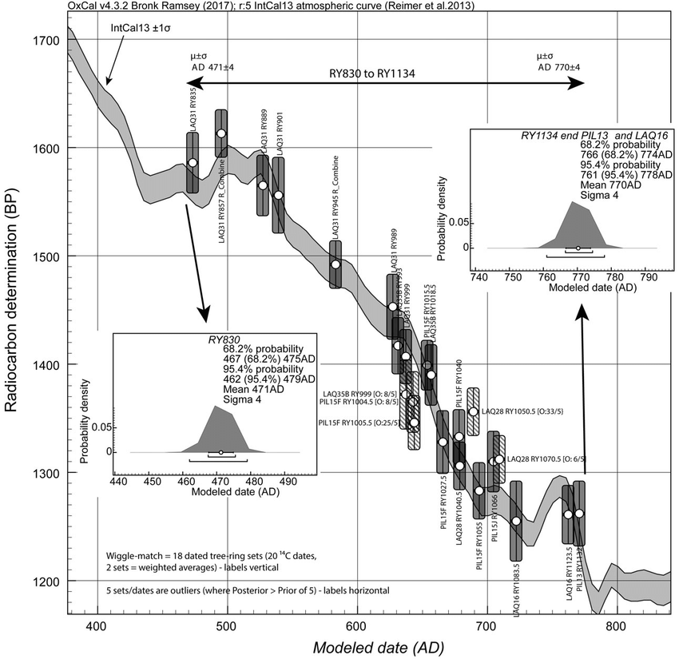
.caption[Source: Turkon et al. 2017]
]
---

## Wiggle Matching
### How it works
.pull-left[
If we have just one date, straight forward calibration:
]

.pull-right[
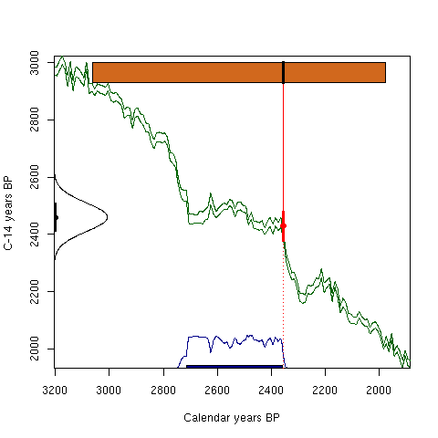
.caption[Source: Maarten Blaauw]
]
---

## Wiggle Matching
### How it works
.pull-left[
If we have multiple dates, where we know the [absolute/relative] temporal distance, the individual calibration might not represent the best combined fit!
]

.pull-right[
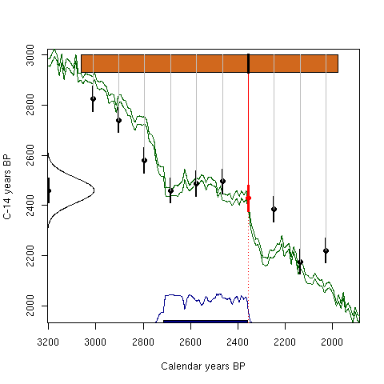
.caption[Source: Maarten Blaauw]
]
---

## Wiggle Matching
### How it works
.pull-left[
But we can calculate the best combined fit! This reduces also the individual uncertainity of the dates!

The animation refers to a situation where we have a depositional model (not absolute distances). With tree rings, it becomes even more contraint (rigid), and by that, the amount of usable information can even be increased.

Technically: similar to the example of Bayesian calibration presented in the presence session.
]

.pull-right[
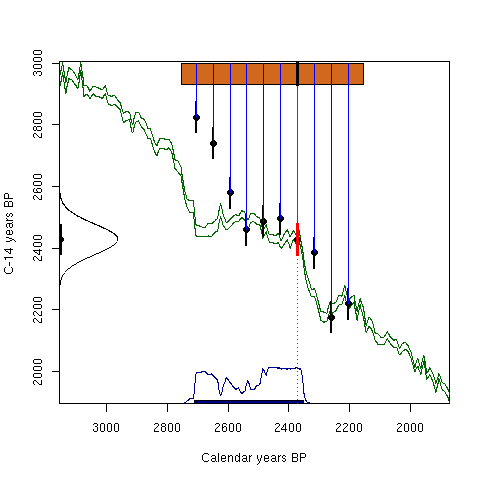
.caption[Source: Maarten Blaauw]
]
---

## Wiggle Matching

.pull-left[
If we know the (relative/absolute) temporal distance between events:
- e.g. tree rings: we know, how many years passed between individual samples
- e.g. depositional processes: we know the relative distance between samples
- Works without Bayes, but also (very well) with Bayes

**Attention**: Again, we make strong assumptions about the temporal arrangements of our samples!
]

.pull-right[
```{r, eval=FALSE}
 D_Sequence( "Wiggle-match example")
 {
  R_Date( "P-14095", 3413, 22);
  Gap( 10);
  R_Date( "P-14096", 3430, 23);
  Gap( 10);
  R_Date( "P-14097", 3432, 22);
  Gap( 10);
  R_Date( "P-14098", 3431, 22);
  Gap( 10);
  R_Date( "P-14099", 3379, 22);
  Gap( 10);
  R_Date( "P-14100", 3371, 23);
  Gap( 10);
  R_Date( "P-14101", 3371, 22);
  Gap( 5);
  Date("Felling date");
 };
```
]
---

## Summed Probability

.pull-left[
If we want to have a (rough) overview of the overall distribution of the data of a series of related events:
- e.g. the total use of a burial ground
- e.g. the total occupancy of a settlement
- Very simple statistics, statistical scatter of data is not taken into account

**Attention**: The OxCal manual states:

> Combining probability distributions by summing is usually difficult to justify statistically but it will generate a probability distribution which is a best estimate for the chronological distribution of the items dated (Sum). The effect of this form of combination is to average the distributions and not to decrease the error margins as with other forms of combination.

]

.pull-right[
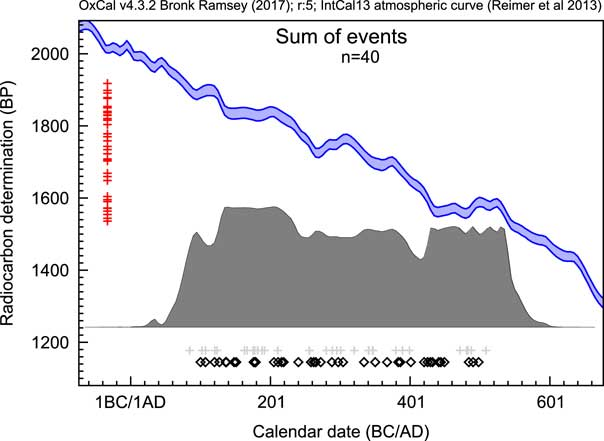
.caption[Source: Bronk Ramsey 2017]
]
---
## Sum
### An experiment
.pull-left[
Remember our two dates?

```{r}
sample1
sample2
```
]

.pull-right[
```{r, echo=FALSE, warning=FALSE, message=FALSE}
dist_range <- 1800:2100
plot(dist_range, dnorm(dist_range, mean = sample1, sd=25), type="l", ylab="Probability")
lines(dist_range, dnorm(dist_range, mean = sample2, sd=25), col="red")
```
]

---
## Sum
### An experiment

.pull-left[
Calibration individually
]

.pull-right[
```{r, echo=FALSE, warning=FALSE, message=FALSE}
plot(oxcAAR::oxcalCalibrate(c(sample1, sample2), c(25,25)))
```
]

---
## Sum
### An experiment

.pull-left[
Now we combine the measurements using the sum:

$$
p_{sum} = p_1 + p_2
$$
Or more general:

$$
p_{sum} = \sum_i p_i
$$

```{r}
sum <- dnorm(
    dist_range, mean = sample1, sd=25
    ) +
  dnorm(
    dist_range, mean = sample2, sd=25
    )
sum <- sum/sum(sum)
```
]

.pull-right[

```{r, echo=FALSE, warning=FALSE, message=FALSE}
plot(dist_range, dnorm(dist_range, mean = sample1, sd=25), type="l", ylim = c(0,max(comb)), ylab="Probability")
lines(dist_range, dnorm(dist_range, mean = sample2, sd=25), col="red")
lines(dist_range, sum, col="green")
```
]
---
## Sum
### An experiment

.pull-left[
And calibrate the sum:
]

.pull-right[
```{r, echo=FALSE, warning=FALSE, message=FALSE}
ox_script <- c(R_Date("sample1", sample1, 25),
               R_Date("sample2", sample2, 25))
ox_script <- paste0(ox_script, collapse="\n")
combine_script <- paste0('Sum("Sum"){', ox_script, "};")
ox_script <- ox_script <- paste0(ox_script, combine_script, collapse="\n")
my_result_file <- executeOxcalScript(ox_script)
my_result_text <- readOxcalOutput(my_result_file)
my_result_data <- parseOxcalOutput(my_result_text, only.R_Date = F)
plot(my_result_data)
```
]
---

## Summed Probability

.pull-left[
If we want to have a (rough) overview of the overall distribution of the data of a series of related events:
- e.g. the total use of a burial ground
- e.g. the total occupancy of a settlement
- Very simple statistics, statistical scatter of data is not taken into account

**Attention**: The OxCal manual states:

> Combining probability distributions by summing is usually difficult to justify statistically but it will generate a probability distribution which is a best estimate for the chronological distribution of the items dated (Sum). The effect of this form of combination is to average the distributions and not to decrease the error margins as with other forms of combination.

]

.pull-right[
```{r, eval=FALSE}
Sum("C")
{
 R_Date("A",2000,20);
 R_Date("B",2010,30);
 R_Date("C",1980,31);
};
```
]
---
## Duration/Basic Modelling

.pull-left[
If we want to have a better overview of the overall distribution of the data of a series of related events:
- e.g. the total use of a burial ground
- e.g. the total occupancy of a settlement
- We introduce Boundaries: We assume, the dates may be wrong, and the actual use phase might have started/ended somewhen around the first/last date (adding contraints)

]

.pull-right[
.center[
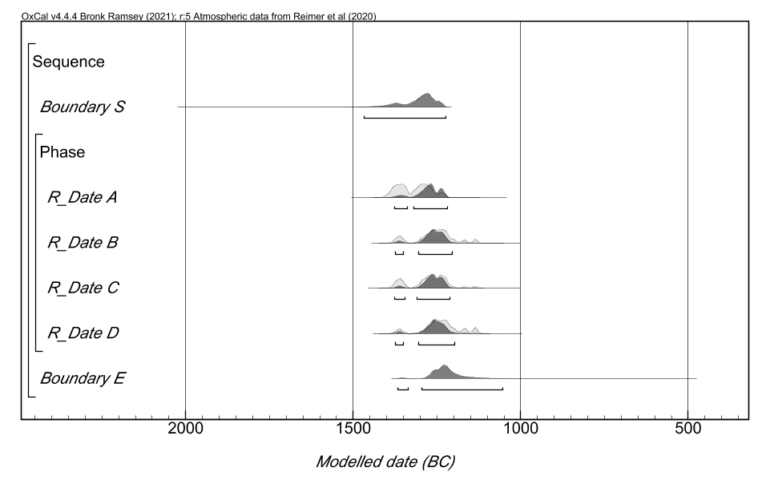
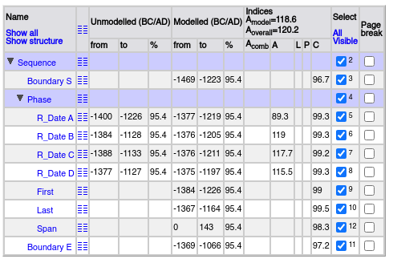
]
]
---

## Duration/Basic Modelling

.pull-left[
We add some commands:

- what is sequential: **Sequence**
- what can not be sequenced: **Phase**
- what represents a border between events that belong together: **Boundary**

And some Queries:

- **Span**: How long has the total event taken place
]

.pull-right[
```{r, eval=FALSE}
 Sequence()
    {
     Boundary("S");
     Phase()
     {
      R_Date("A",3050,25);
      R_Date("B",3010,25);
      R_Date("C",3020,25);
      R_Date("D",3000,25);
      Span();
     };
     Boundary("E");
    };
```
]
---
## Duration/Basic Modelling

.pull-left[
We get *modelled* information -> Posterior probability distributions

- Individual dates are "compressed", because of the fact that they are assumed to belong together
- The span of the occupation can be estimated, taking into account, that the invidual dates have random (statistical) scatter

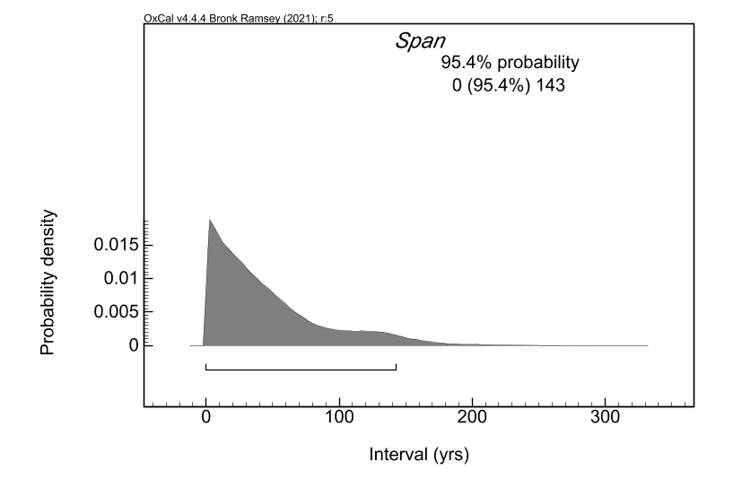

]

.pull-right[
.center[


]
]
---

## Sequential Calibration

.pull-left[
If we have stratigraphical (sometimes also other) external information about the temporal distance between events:
- e.g. layers of an excavation, where we know the order of the dates
- sometimes, but not so reliably: typological considerations can also be incorporated
- Works only with Bayes

**Attention**: Again, we make strong assumptions about the temporal arrangements of our samples!
]

.pull-right[
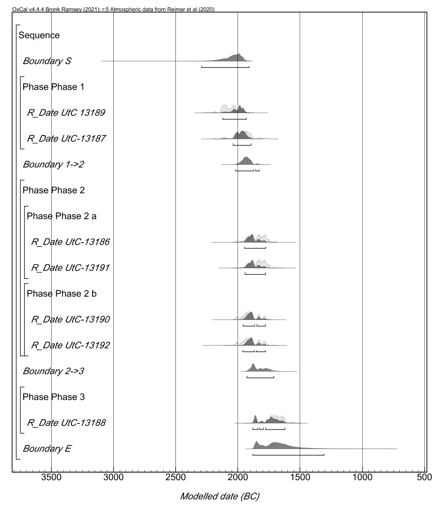
]

---
## Sequential Calibration
### Adding Stratigraphical Informations


.pull-left[
- what is sequential: **Sequence**
- what can not be sequenced: **Phase**
]

.pull-right[
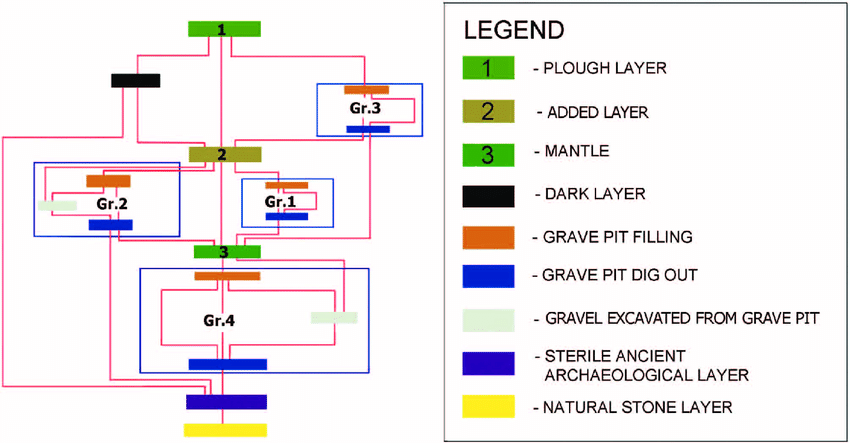
]
---
## Sequential Calibration
### Adding Stratigraphical Informations

You can make this arbitrary complicated!

.pull-left[
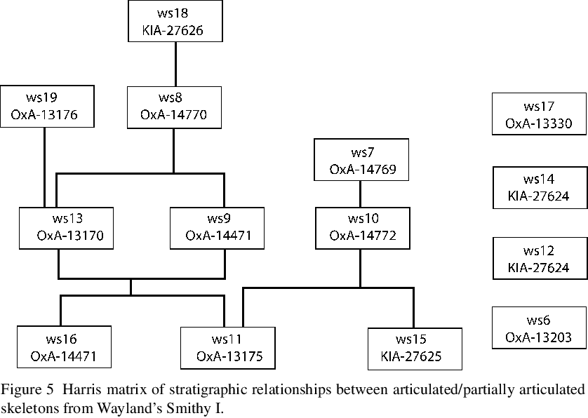
]

.pull-right[
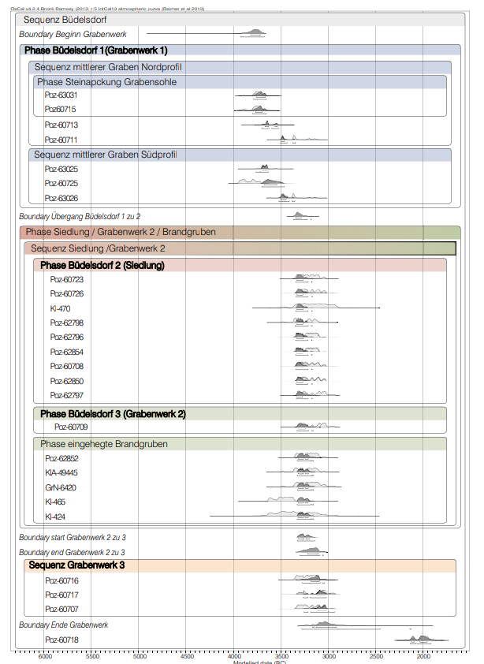
]
---
## Sequential Calibration
### Adding Stratigraphical Informations


.pull-left[
- what is sequential: Sequence
- what can not be sequenced: Phase

### 14C dates
- Grab 29 (UtC 13189) 3671 ± 33 BP
- Grab 20 (UtC-13187) 3600 ± 38 BP
- Grab 31 (UtC-13190) 3560 ± 36 BP
- Grab 42 (UtC-13192) 3559 ± 41 BP
- Grab 18 (UtC-13186) 3531 ± 40 BP
- Grab 32 (UtC-13191) 3521 ± 37 BP
- Grab 27 (UtC-13188) 3409 ± 38 BP
]
.pull-right[
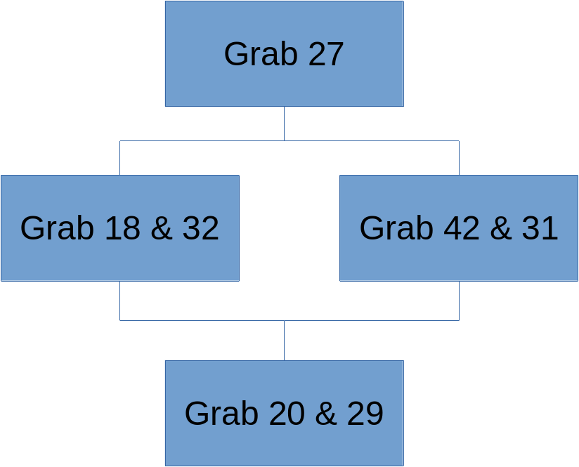
]
---
## Sequential Calibration

.pull-left[
### Adding Stratigraphical Informations
.tiny[
- what is sequential: Sequence
- what can not be sequenced: Phase

### 14C dates
- Grab 29 (UtC 13189) 3671 ± 33 BP
- Grab 20 (UtC-13187) 3600 ± 38 BP
- Grab 31 (UtC-13190) 3560 ± 36 BP
- Grab 42 (UtC-13192) 3559 ± 41 BP
- Grab 18 (UtC-13186) 3531 ± 40 BP
- Grab 32 (UtC-13191) 3521 ± 37 BP
- Grab 27 (UtC-13188) 3409 ± 38 BP
]

]
.pull-right[
.tiny[
```{r, eval=FALSE}

 Plot()
 {
  Sequence()
  {
   Boundary("S");
   Phase("Phase 1")
   {
    R_Date("UtC 13189", 3671, 33);
    R_Date("UtC-13187", 3600, 38);
   };
   Boundary("1->2");
   Phase("Phase 2")
   {
    Phase("Phase 2 a")
    {
     R_Date("UtC-13186", 3531, 40);
     R_Date("UtC-13191", 3521, 37);
    };
    Phase("Phase 2 b")
    {
     R_Date("UtC-13190", 3560, 36);
     R_Date("UtC-13192", 3559, 41);
    };
   };
   Boundary("2->3");
   Phase("Phase 3")
   {
    R_Date("UtC-13188",3409,38);
   };
   Boundary("E");
  };
 };
```
]]
---

## Sequential Calibration

.pull-left[
If we have stratigraphical (sometimes also other) external information about the temporal distance between events:
- e.g. layers of an excavation, where we know the order of the dates
- sometimes, but not so reliably: typological considerations can also be incorporated
- Works only with Bayes

**Attention**: Again, we make strong assumptions about the temporal arrangements of our samples!
]

.pull-right[
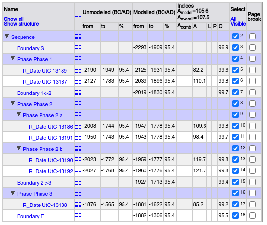
]
---
## Sequential Calibration
### Types of Boundaries
.pull-left[
- Boundary([Name], [Expression]);
- Sigma_Boundary([Name], [Expression]);
- Tau_Boundary([Name], [Expression]);
- Zero_Boundary([Name], [Expression]);

Also interesting: Trapezoidal boundaries for gradual transition (eg. cultural phases)

```{r eval=F}
Boundary("MidStart")
     {
      Transition("Duration Start");
      Start("Start Start");
      End("End Start");
     };
```


]

.pull-right[
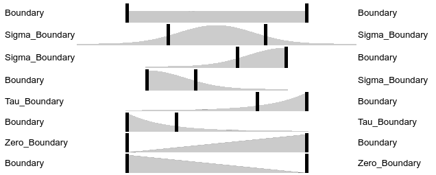


]
---
## OxCal
### Further possible topics

- outlier analysis (Outlier & Outlier_Model)
- Deposition models (D_Sequence, V_Sequence, P_Sequence, U_Sequence, )
- ...

more at the [OxCal help page](https://c14.arch.ox.ac.uk/oxcalhelp/hlp_contents.html)
---
class: inverse, middle, center
# Any questions?

.footnote[
.right[
.tiny[
You might find the course material (including the presentations) at

https://berncodalab.github.io/caa

You can contact me at

<a href="mailto:martin.hinz@iaw.unibe.ch">martin.hinz@iaw.unibe.ch</a>

]
]
]
