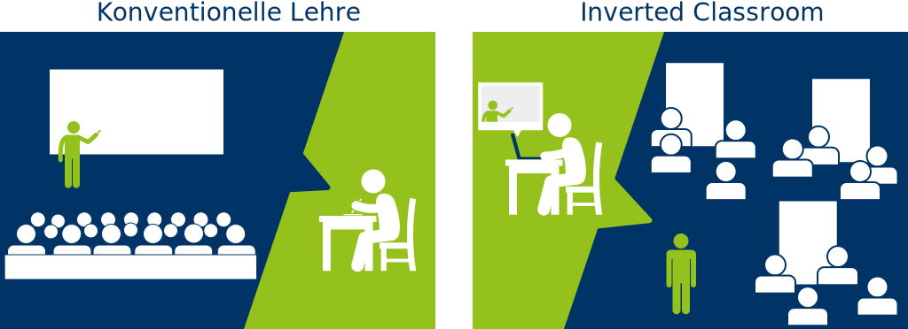

class: title-slide, center, middle
```{r, echo = FALSE}
# https://stackoverflow.com/questions/25646333/code-chunk-font-size-in-rmarkdown-with-knitr-and-latex
def.chunk.hook  <- knitr::knit_hooks$get("chunk")
knitr::knit_hooks$set(chunk = function(x, options) {
  x <- def.chunk.hook(x, options)
  ifelse(options$size != "normalsize", paste0("\\", options$size,"\n\n", x, "\n\n \\normalsize"), x)
})
```

```{r, echo = FALSE, results="asis"}
cat('# ', rmarkdown::metadata$title)
```

```{r, echo = FALSE, results="asis"}
cat('## ', rmarkdown::metadata$subtitle)
```

```{r, echo = FALSE, results="asis"}
cat('### ', rmarkdown::metadata$author)
```

```{r, echo = FALSE, results="asis"}
cat('#### ', rmarkdown::metadata$institute)
```

```{r, echo = FALSE, results="asis"}
cat(rmarkdown::metadata$date)
```

---
## What is not computer aided archaeology
### in relation to our course

.center[]

---
## What is computer aided archaeology

### Topics<sup>*</sup>

.pull-left[
1. The use of **digital data** in archaeological research.
2. The general **use of computers** in archaeological research.
3. The use of **computational algorithms to fill gaps in archaeological data** in ways that can’t be done with traditional techniques.
4. **Data mining** and **multidimensional analyses** of archaeological data.
5. The use of **simulation models and artificial intelligence** to understand the processes and dynamics of past societies.
6. The use of **computer visualizations** to create immersive **virtual** experiences of archaeological sites and materials

.footnote[[*] from http://isaacullah.github.io/What-is-Computational-Archaeology/]
]
.pull-right[

]
---

## What is computer aided archaeology

### Fields<sup>*</sup>

.pull-left[
1. **GIS and geospatial data analysis.**
2. **Digital imagery and photogrammetry.**
3. **Statistical computing and quantitative analysis.**
4. **Data visualization.**
5. Agent Based Modeling and simulation.
6. 3D modeling, virtual reality, and augmented reality.
7. Video gaming and digital animation.

We will touch the **highlighted** subjects.

.footnote[[*] from http://isaacullah.github.io/What-is-Computational-Archaeology/]
]

.pull-right[

.caption[Sorry, no fancy 3D Modelling (this time)]
]
---

## Other terms

.pull-left[
* Computational Archaeology
* Cyber Archaeology
* Digital Archaeology
* Archaeoinformatics
* Digital Humanities


]

.pull-right[

]
---
## Schedule
.tiny[
```{r echo=FALSE}
library(magrittr)
library(kableExtra)

schedule <- read.csv("../syllabus.csv")

knitr::kable(schedule[,1:3])  %>%
  kable_styling(bootstrap_options = c("striped", "hover"),
                latex_options = "striped",
                full_width = T)
```
]
---
.pull-left[
### Learning Content
In presence as frontal lecture

### Applying Content
On your own as homework
]
.pull-right[
### Learning Content
On your own at home

### Applying Content
Supervised in presence
]

.center[

.caption[source: https://dbs-lin.ruhr-uni-bochum.de/lehreladen/e-learning-technik-in-der-lehre/inverted-classroom/was-ist-inverted-classroom]
]
---
## Website

[https://berncodalab.github.io/caa](https://berncodalab.github.io/caa)


---
## Computers as research tools

### What is it

- review literature
- collect data
- structure information
- process images
- write a paper

.center[
 vs. 
]

---
## Computers as research tools

### only session

.pull-left[
- Types of Digital Data
- Working with Digital Data
- Software suggestions
- Using citation software


]

.pull-right[
- structuring your research environment
- working with open and sustainable formats
- glimpse on
  - markdown
  - latex
  - version control


]

---
## Databases

### What is it

.pull-left[

>  A database is an organized collection of data, generally stored and accessed electronically from a computer system. - Wikipedia

- on one computer -> for personal data organisation
  - Libre Office, MS Access, Sqlite
  - single file
- server - client, often web based
  - PostgreSQL, MySQL
  - data exchange and collaborative data management
]

.pull-right[

Relates different information on different abstraction levels eg.:

1 site <-> multiple artefacts

```{r echo=FALSE, message=F}
library(DiagrammeR)
my_dia <- DiagrammeR::grViz("
digraph models_diagram {
    rankdir='LR';
    graph[overlap=false, splines=true]
    'site' [shape=record, label='{\\
      site|name :string\\l\\
      lat :float\\l\\
      lng :float\\l\\
    }']
    
    'artefact' [shape=record, label='{artefact|\\
      material :string\\l\\
      weight :string\\l\\
    }']
    

    'site' -> 'artefact' [arrowtail=odot, arrowhead=crow, dir=both, label='belongs_to']
}", height=100, width=400)

my_dia
```
]

---
## Databases

### First section

.pull-left[
Create a simple data base

- site information
- artefact information

- lookup tables


]

.pull-right[
Topics

- data normalisation
- table design
- variable types
- form creation


]

---
## Databases

### Second section

.pull-left[
Retrieve informations from the data base

- queries
- joining tables
- exporting data

.center[]
]

.pull-right[
Topics

- query logic
- sql
- csv


]
---
## Visualisation

### What is it
> Data visualization is the graphic representation of data. It involves producing images that communicate relationships among the represented data to viewers of the images. - wikipedia

- 'statistical' charts like barcharts, pie charts, scatterplots...
- humans are visual animals
- explore data / find structures
- visualise multidimensional relationships

.center[

]

---
## Visualisation

### First section

.pull-left[
- prepare your data for visualisation
- Basic visualisation using spreadsheat software (LibreOffice Calc)
- export for later (re)use


]

.pull-right[
- handling spreadsheat software
- scatterplots, bar charts, histograms
- visualisation best practises


]
---
## Visualisation

### Second section

.pull-left[
- Visualisation of highdimensional data
- Correspondence Analysis
- Seriation


]

.pull-right[
- preparing your data
- conduct correspondence analysis
- interpret the result


]
---
## Basic Statistics / Hypothese testing

### What is it

> A statistical hypothesis, sometimes called confirmatory data analysis, is a hypothesis that is testable on the basis of observing a process that is modeled via a set of random variables.[1] A statistical hypothesis test is a method of statistical inference. - wikipedia

- decide between hypotheses using standardised (mathematical) tools
- probability theory
- scientific method

.center[


]

---
## Basic Statistics

### Only section

.pull-left[
- Basics of hypothese testing
- H_0_ and H_1_
- statistical significance


]

.pull-right[
- data preparation
- Chi-Square Test
- Interpretation


]
---
## 14C Calibration

### What is it

.pull-left[

]

.pull-right[

]
---
## 14C Calibration

### First section

- understand the calibration process
- being able to calibrate individual dates

.center[


]

---
## 14C Calibration

### Second section

- translate stratigraphical sequences into OxCal models
- doing sequential calibration

.center[


]

---
## GIS

### What is it

> A geographic information system (GIS) is a system designed to capture, store, manipulate, analyze, manage, and present spatial or geographic data. - Wikipedia

.center[


]

.right[

]

---
## GIS

### First section

- basically understand projection systems
- being able to map geographical locations with background maps
- digitizing/georeferencing maps


---
## GIS

### Second section

- thematic mapping
- interpolation

.center[


]


---

## Software in this course

- free (and most of the time) open source software
- most basic software

.small[

### Zotero

- free and open source (FOSS) citation manager
- integrates well in browser and Office Software

### Libre Office

- FOSS office package
- most commands and procedures similar to 'the other' office package

### OxCal

- free, but not open source
- quasi standard in archaeology

### QGIS

- FOSS GIS package
- General ideas and concepts are transferable to 'the other' GIS software

]

---
## Prerequisite for successful participation

- a laptop (if you do not own one, we can provide you)
- endurance
- curiosity
- installing some software

And in the end a test, consisting of a theoretical and a practical part

Test will be written after the semester.

---
## ToDo till next meeting

- Install Libre Office (https://de.libreoffice.org/)
- Install Zotero (https://www.zotero.org/)

- (optional) install Zotero Connector (https://www.zotero.org/download/connectors)

---
class: inverse, middle, center
# Any questions?

.footnote[
.right[
.tiny[
You might find the course material (including the presentations) at

https://berncodalab.github.io/caa

You can contact me at

<a href="mailto:martin.hinz@iaw.unibe.ch">martin.hinz@iaw.unibe.ch</a>
]
]
]
